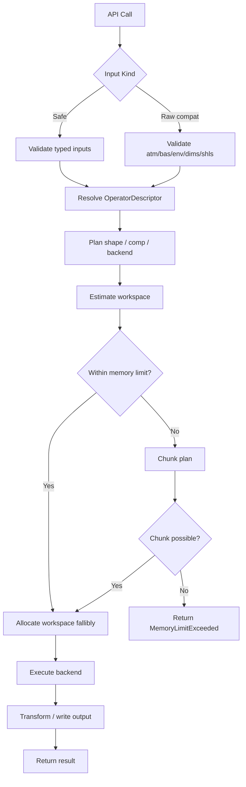
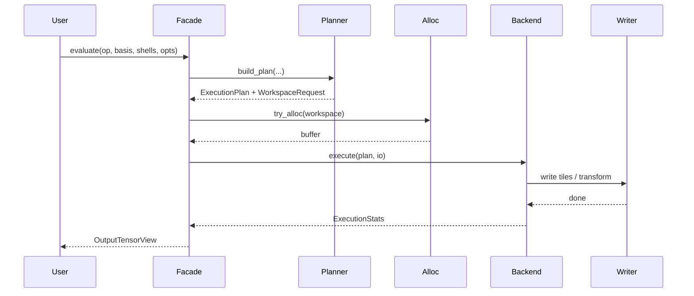
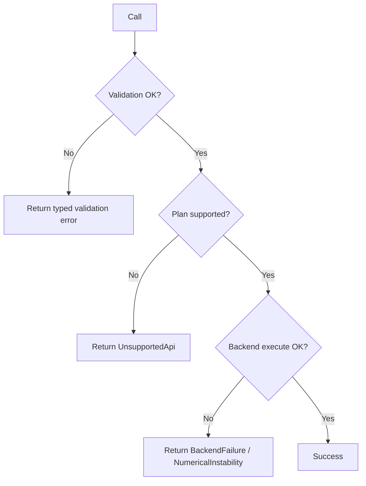
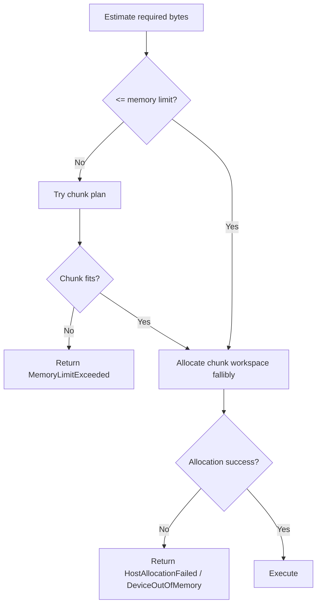
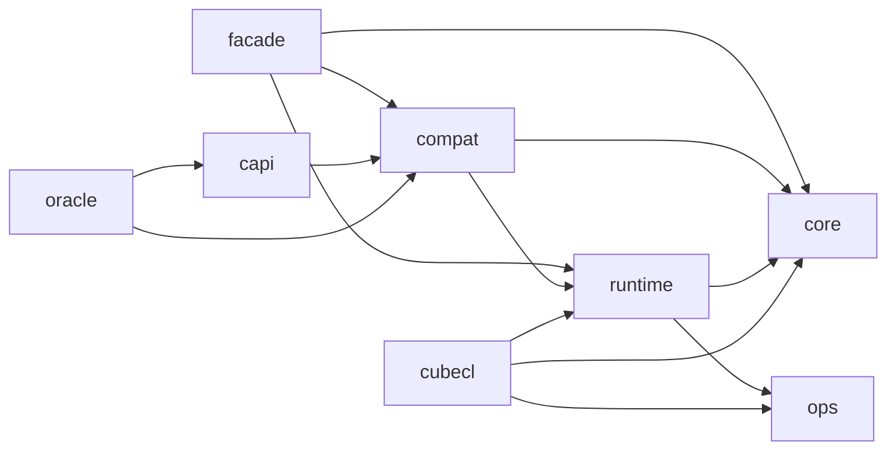

# Detailed Design Document for the Rust Redesign and Reimplementation of libcint (Re-review Reflected Edition)

- Document version: 0.5-final-unified-1e12
- Target: A public library that redesigns and reimplements libcint in Rust
- Target upstream: cintx 6.1.3 (`README.rst:4-5`)
- Purpose of this document: To define a detailed design whose primary goal is result compatibility with cintx while also satisfying Rust-native type safety, speed, memory efficiency, and ease of verification
- libcint path:/home/chemtech/workspace/cintx/libcint-master
---

## 0. Positioning of This Document, Premises, Assumptions, and Design Decisions Finalized in This Revision

### 0.1 Positioning of This Document
This document is the finalized design specification produced by re-reviewing the existing reviewed version of the detailed design and clarifying the points that would otherwise remain ambiguous when implementation begins. The following areas are strengthened in particular.

1. **Audit method for the full API inventory**
2. **Implementation rules for OOM-safe stop behavior**
3. **Contract for `dims` / buffers / complex layout in the raw compatibility API**
4. **Specification organization for helper / legacy / transform APIs**
5. **Operation of release gates and regression detection**

### 0.2 Primary Sources
| Primary source | Purpose |
|---|---|
| `README.rst` | Scope, thread safety, generic API, error characteristics, performance assumptions |
| `include/cint_funcs.h` | Integral API family declarations |
| `include/cint.h.in` | Helper / optimizer / legacy wrapper / slot definitions |
| `scripts/auto_intor.cl` | Auto-generation DSL and family generation rules |
| `doc/program_ref.txt` | Data layout, `atm/bas/env`, `shls`, output ordering |
| `src/*.c` | Implementations, source-only APIs, optional build conditions |
| `testsuite/*` | Tolerances and covered families |
| `examples/*` | Usage patterns |
| `/tmp/cintx_artifacts/cintx_rust_api_manifest.csv` | Manifest snapshot at design time |

### 0.3 Premises
1. The compatibility target includes the integral APIs declared in `include/cint_funcs.h`, the helper / optimizer / legacy wrapper APIs in `include/cint.h.in`, and source-only / optional APIs that are implemented in `src` and reachable through build options or tests. Basis: entire `include/cint_funcs.h`, `include/cint.h.in:227-291`, `src/cint2e_f12.c:12-201`, `src/cint4c1e.c:324-357`
2. The primary measure of compatibility is **equivalence of computed results**; equality of internal implementation, internal scratch layout, and intermediate representations is not required. Basis: `README.rst:38-40`, `README.rst:208-235`
3. The GPU backend assumes CubeCL. This is a design constraint and is not part of upstream cintx itself.
4. The public library returns typed errors using `thiserror v2`, while CLI / benchmark / oracle harness / CI glue use `anyhow`.
5. Writing deliverables to `/tmp/cintx_artifacts` is mandatory.

### 0.4 Assumptions
| ID | Assumption | Rationale |
|---|---|---|
| A1 | The library has three layers: Safe Rust API, raw compatibility API, and optional C ABI shim | To balance Rust usability and cintx migration compatibility |
| A2 | Source-only exported APIs are initially provided under the `unstable-source-api` feature | To separate the stability of APIs not listed in upstream headers |
| A3 | GTG families are excluded from the initial GA scope | Because upstream marks them as deprecated / incorrect (`CMakeLists.txt:104-111`) |
| A4 | 4c1e is provided behind the `with-4c1e` feature | Because upstream notes bugs in it (`CMakeLists.txt:113-116`) |
| A5 | Claiming "full API coverage" requires passing a compiled symbol audit | Because header/source diffs alone are insufficient |
| A6 | CubeCL is the primary and reference compute implementation, and the host CPU is limited to control-plane work | To unify the execution model and eliminate duplicate compute backends |

### 0.5 Design Decisions Finalized in This Revision
| Item | Finalized decision | Impact | Reflected in |
|---|---|---|---|
| Final manifest for source-only exported symbols | The source of truth is `crates/cintx-ops/generated/compiled_manifest.lock.json`, and the final manifest is the **union of compiled symbols** across the support matrix `{base, with-f12, with-4c1e, with-f12+with-4c1e}`. The GTG profile is not included in the support matrix | Full API inventory, CI, release gate | 3.2, 3.3, 14.1, 16.2, 16.5 |
| Edge case for `dims != NULL` | In compat/C ABI, the dimension formula in section 3.6.1 of this design is the only contract; partial writes and implicit truncation are disallowed | Raw compat implementation, oracle comparison | 3.6.1, 7.2, 11.1 |
| 4c1e bug envelope | The accepted range for 4c1e is limited to **cart/sph, scalar, natural dims, max(l)<=4, CubeCL backend, and oracle+identity test pass**; all other cases are treated as `UnsupportedApi` | Execution conditions for 4c1e, tests, release gate | 3.11.2, 12.5, 13.4, 16.4 |
| Representation coverage of F12/STG/YP | In the current upstream snapshot, the supported representation for F12/STG/YP is finalized as **sph only**; cart/spinor are treated not as "missing" but as "out of scope" | Feature matrix, oracle comparison, release gate | 3.11.3, 10.1, 13.4, 16.2 |
| Positioning of GTG | GTG is included in none of initial GA, optional, or unstable; it is **roadmap-only and out of scope**. No public feature flag is added | Scope, manifest, tests, documentation | 1.3, 3.3.1, 10.1, 16.2, 18 |
| Parity of helper transform APIs | Helper comparison is included in the stable release gate | Helper API implementation and CI | 13.4, 14.1 |
| Oracle tolerance policy | All oracle comparisons, regression gates, and release-blocking numerical checks use a unified `atol = 1e-12` and `rtol = 1e-12`; any exceedance is treated as a kernel bug and must block completion until fixed | Oracle harness, CI, release gate, difference analysis | 2.7, 13.8, 13.9, 14.1, 16.4, 17 |

---

## 1. Executive Summary

### 1.1 Objective
This design document defines an **implementation-ready detailed design** for redesigning and reimplementing the API families provided by cintx in Rust. The primary goals are as follows.

1. Achieve **near-equivalent API results** to cintx
2. Provide a **type-safe API** that is natural for Rust users
3. Deliver **high speed** and **good memory efficiency**
4. **Stop safely on OOM**
5. Provide **maintainability, observability, and testability** as a public library

Basis: `README.rst:11-14`, `README.rst:38-40`, `README.rst:52-70`, `README.rst:208-235`

### 1.2 Scope
- Base APIs and concrete symbols in `include/cint_funcs.h`
- Helper / optimizer / legacy wrapper / transform APIs in `include/cint.h.in`
- Source-only / optional exported families in `src` (F12/STG/YP, 4c1e, origi/origk, additional Breit, 3c2e_ssc, etc.)
- CubeCL backend for all integral-family computation (the host CPU remains limited to validation, planning, marshaling, and oracle/test glue)
- Raw compatibility API, Safe Rust API, and optional C ABI shim

### 1.3 Out of Scope
- Matching cintx’s internal implementation
- Bitwise identical results
- Reproducing the Fortran wrapper
- Public exposure of GTG, which upstream marks as deprecated / incorrect
- Asynchronous public API

### 1.4 Most Important Design Decisions
| Item | Adopted decision | Rationale |
|---|---|---|
| Compatibility model | **Result compatibility > API compatibility > implementation compatibility** | Because the original requirement prioritizes results |
| Public surface | Safe Rust API first, raw compat API second, C ABI shim optional | To balance Rust usability and migration compatibility |
| Execution model | Shared planner + CubeCL backend executor | To keep one compute path while preserving shared planning and optimization headroom |
| OOM | Centralize fallible allocation and stop with typed errors on failure | Because safe stop is a mandatory requirement |
| API inventory | Use the generated manifest as the sole source of truth | To make full API coverage verifiable |
| Optional families | Explicit feature gates and stability levels | Because upstream itself contains conditional / unstable APIs |
| Unsafe code | Limit `unsafe` to FFI, SIMD, device buffers, and raw layout writers | To ensure maintainability and auditability |

### 1.5 cintx Compatibility Policy
- Provide a **raw compatibility API** that accepts `atm/bas/env` and `shls/dims/cache/opt`
- Reproduce the contracts of `out == NULL` / `cache == NULL` / `dims == NULL` in the compat / C ABI layers
- Split the Safe Rust API into `query_workspace()` and `evaluate()` so users are not exposed to C-style sentinel arguments
- Match cintx for cart/sph/spinor shapes, component ordering, and complex interleaving
- Guarantee that numerical results do not change depending on whether an optimizer is used

### 1.6 Rust-Native Design Policy
- Represent `Atom`, `Shell`, `BasisSet`, `EnvParams`, `OperatorId`, `ExecutionPlan`, and `OutputTensorView` with explicit types
- Confine raw array offset interpretation to the compat layer
- Make the allocator / tracer / backend / oracle pluggable through traits and dependency injection
- Use `tracing` to visualize planner decisions, chunking, fallback, OOM, and GPU transfer

---

## 2. Requirement Breakdown

### 2.1 Functional Requirements
| ID | Requirement | Details |
|---|---|---|
| FR-01 | Cover all cintx APIs | Includes base APIs, helpers, optimizers, legacy wrappers, and source-only / optional families |
| FR-02 | Support cart / sph / spinor | Specify shape and layout per representation |
| FR-03 | Support 1e / 2e / 2c2e / 3c1e / 3c2e / 4c1e | Includes feature gating |
| FR-04 | Provide a raw compatibility API | Accepts `atm/bas/env` directly |
| FR-05 | Provide a Safe Rust API | Type-safe high-level API |
| FR-06 | Provide an optional C ABI shim | For phased migration and C interoperability |
| FR-07 | Provide a single logical API backed by CubeCL | Shared planner with a single compute backend |
| FR-08 | Support batching / chunking / memory limits | Balance safe stop with throughput for large-scale evaluation |
| FR-09 | Provide helper / transform / optimizer APIs | Compatibility scope includes not only the integral core but also cintx utility APIs |

### 2.2 Non-Functional Requirements
| ID | Requirement | Design mapping |
|---|---|---|
| NFR-01 | High speed | Shell bucketing, screening, host-side batching, Rayon-assisted staging, CubeCL specialization |
| NFR-02 | Memory efficiency | SoA metadata, workspace pools, direct output write |
| NFR-03 | OOM-safe stop | Fallible allocation wrapper, memory estimator, chunking, typed errors |
| NFR-04 | Maintainability | Generated manifest, trait-based backends, feature matrix, unsafe policy |
| NFR-05 | Observability | `tracing` spans / metrics / fallback reason / OOM reason |
| NFR-06 | Ease of testing | Oracle harness, property tests, fail allocator, mock backend |
| NFR-07 | Reproducibility | Vendored oracle build, pinned toolchain, artifactized manifest |

### 2.3 Compatibility Requirements
| ID | Requirement | Evaluation method |
|---|---|---|
| CR-01 | API results are nearly equivalent to cintx | Oracle comparison |
| CR-02 | Specifications are organized for all APIs | Manifest + helper table + feature matrix |
| CR-03 | Internal implementation differences are allowed | Defined explicitly in the document |
| CR-04 | Values do not change with/without optimizer | Regression test |
| CR-05 | Match complex layout and output ordering | Compat writer tests |
| CR-06 | Unsupported optional APIs are explicitly distinguished | `UnsupportedApi` / feature matrix |

### 2.4 Performance Requirements
- The planner shall have CubeCL launch/transfer/chunking heuristics
- It shall evaluate both throughput per batch and peak memory
- Small problems are handled by reducing specialization and chunk size, but the compute path remains CubeCL
- The baseline is fixed after the initial implementation, but **continuous cintx comparison benchmarking** is mandatory
- The planner shall emit backend-selection and queue-selection reasons through `tracing`

### 2.5 Memory Constraints
- Users can specify `memory_limit_bytes`
- The planner estimates host/device workspace
- If the limit is exceeded, chunking is attempted; if impossible, return `MemoryLimitExceeded`
- Even when direct write is not possible, intermediates must be minimized and double-holding is prohibited
- Large allocations that do not pass through the fallible allocator are forbidden

### 2.6 Error-Handling Policy
- Public: `Result<T, cintxRsError>` (`thiserror v2`)
- App boundary / benchmark / oracle harness / xtask: `anyhow::Result<T>`
- C ABI: integer status + thread-local last-error API
- Distinguish numerical instability / unsupported API / OOM / device failure / input layout failure

### 2.7 Testing and Verification Requirements
- Coverage audit against the all-API manifest
- Oracle comparison, property tests, failure-path tests, OOM tests, and CubeCL consistency tests
- All numerical oracle comparisons and regression checks shall satisfy a unified `atol = 1e-12` and `rtol = 1e-12` across all operator categories
- Helper / legacy / transform APIs are also included in comparison coverage

---

## 3. Organization of cintx Specifications

### 3.1 API Layers Provided by cintx
| Layer | Content | Treatment on the Rust side |
|---|---|---|
| Integral family API | `NAME_cart/sph/spinor`, `NAME_optimizer` | Managed in the manifest and implemented in full |
| Helper API | AO counts, offsets, normalization, transform, optimizer init/del | Provided through compat and safe helpers |
| Legacy wrapper API | `cint2e_*` and `cNAME*` when `WITH_CINT2_INTERFACE` is enabled | Provided through compat / optional C ABI |
| Internal-ish but reachable API | Source-only families, optional 4c1e/F12 | Managed via feature gates + stability levels |

### 3.2 Definition of API Inventory
The design-time inventory is based on `/tmp/cintx_artifacts/cintx_rust_api_manifest.csv`.

| Scope | Count | Basis |
|---|---:|---|
| `cint_funcs.h` base APIs | 190 | Manifest CSV |
| `cint_funcs.h` concrete symbols | 760 | `forms` column in the manifest CSV |
| Source-only / optional base APIs | 25 | Manifest CSV |
| Helper / wrapper / transform APIs | 34 | `include/cint.h.in:227-291` |

**Important**: The design-time CSV is an explanatory snapshot. At release time, the ultimate source of truth is `compiled_manifest.lock.json`. The lock is generated from the union of compiled symbols across the support matrix `{base, with-f12, with-4c1e, with-f12+with-4c1e}`, and GTG builds are not included as inputs to the lock.

### 3.3 Manifest Schema
The generated manifest in `cintx-ops` must contain at least the following fields.

| field | Meaning |
|---|---|
| `family_name` | Base API name |
| `symbol_name` | Concrete exported symbol name |
| `category` | 1e / 2e / 2c2e / 3c1e / 3c2e / 4c1e / helper / legacy |
| `arity` | Length of shell tuple |
| `forms` | cart/sph/spinor/optimizer/c-wrapper, etc. |
| `component_rank` | Scalar / vector / tensor rank |
| `feature_flag` | `none`, `with-f12`, `with-4c1e`, `unstable-source-api`, etc. |
| `stability` | `stable`, `optional`, `unstable_source` |
| `declared_in` | header / source |
| `compiled_in_profiles` | Which of `base` / `with-f12` / `with-4c1e` / `with-f12+with-4c1e` it appears in |
| `oracle_covered` | Whether it is covered by CI comparison |
| `helper_kind` | helper / transform / optimizer lifecycle / legacy |
| `canonical_family` | Family name normalized from wrapper / Fortran suffix |

#### 3.3.1 Finalization Method for the Compiled-Symbol-Based Final Manifest
- **Purpose**: Fix the actually exposed ABI surface, rather than relying on header/source description differences, and make “full API coverage” mechanically auditable
- **Source of truth**: `crates/cintx-ops/generated/compiled_manifest.lock.json`
- **Generation procedure**:
  1. Build upstream sources under the support matrix `{base, with-f12, with-4c1e, with-f12+with-4c1e}`
  2. Extract exported symbols from each profile’s shared library using `nm -D --defined-only`
  3. Normalize the Fortran suffix `_`, legacy wrapper prefix `c`, representation suffixes, and optimizer suffixes with `canonicalize_symbol()`, and map them to `canonical_family`
  4. Classify header-derived, helper/legacy-derived, and source-only-derived items via `declared_in` and `helper_kind`
  5. Save the union of the 4 profiles as the lock file
- **Mapping method for source-only exported APIs**: Define as source-only exported APIs those symbols where `declared_in = source` and `canonical_family` does not exist in header declarations. If even one symbol cannot be normalized, fail the build and require an explicit entry in `compiled_symbol_overrides.toml`
- **When to generate**: Manually update only when the upstream version changes, the feature matrix changes, or the manifest schema changes. Normal builds do not regenerate it; CI checks only the diff between regenerated output and the lock
- **Versioning policy**: The lock file stores `upstream_version`, `manifest_schema_version`, and `support_matrix_version`. Lock updates are permitted only when one of these changes
- **Diff detection method**: Detect additions / deletions / metadata changes as three categories, with different fail policies for `stable`, `optional`, and `unstable_source`
- **How it is used in CI / verification / release gates**:
  - PR CI: detect diffs between the regenerated manifest and the lock; fail on any diff
  - Oracle CI: families with diffs are automatically promoted into comparison targets
  - Release gate: only `lock diff = 0` or explicitly approved diffs are allowed
- **Compatibility criteria**:
  - `stable`: every symbol in the lock is implemented and passes oracle comparison
  - `optional`: when the corresponding feature is enabled, symbols match the lock and pass oracle comparison
  - `unstable_source`: when the feature is enabled, symbols match the lock and pass nightly extended CI
- **Exception handling**: Retain the Fortran wrapper `_` and toolchain-dependent aliases in the lock as `abi_visibility = auxiliary`, but exclude them from the denominator of public surface coverage. GTG profiles are outside the support matrix and are therefore excluded from lock generation
- **Testing method**:
  - Unit: `canonicalize_symbol()` and `declared_in` classification logic
  - Integration: 4-profile build + lock diff
  - Oracle: re-compare families with diffs

### 3.4 Generic Integral Signature
```c
function_name(
    double *out,
    int *dims,
    int *shls,
    int *atm, int natm,
    int *bas, int nbas,
    double *env,
    CINTOpt *opt,
    double *cache
);
```
Basis: `README.rst:200-210`, `include/cint_funcs.h:10-16`

#### 3.4.1 Legacy Wrapper Signature
- 1e: `not0 = cNAME_{cart|sph|spinor}(buf, shls, atm, natm, bas, nbas, env)`
- 2e: `not0 = cNAME_{cart|sph|spinor}(buf, shls, atm, natm, bas, nbas, env, opt)`
- `not0` is a summary boolean meaning “the full result is not all zero”

Basis: `README.rst:41-50`, `src/misc.h:34-76`

### 3.5 Argument Specifications
#### 3.5.1 `atm`
| slot | Meaning | Basis |
|---|---|---|
| `CHARGE_OF` | Nuclear charge | `include/cint.h.in:48-55`, `doc/program_ref.txt:34-45` |
| `PTR_COORD` | Offset to coordinate start | Same as above |
| `NUC_MOD_OF` | Nuclear model kind | Same as above |
| `PTR_ZETA` | Zeta for the Gaussian nuclear model | Same as above |
| `PTR_FRAC_CHARGE` | Fractional charge | `include/cint.h.in:48-55` |

#### 3.5.2 `bas`
| slot | Meaning | Basis |
|---|---|---|
| `ATOM_OF` | Corresponding atom index | `include/cint.h.in:58-67`, `doc/program_ref.txt:46-69` |
| `ANG_OF` | Angular momentum `l` | Same as above |
| `NPRIM_OF` | Number of primitives | Same as above |
| `NCTR_OF` | Number of contractions | Same as above |
| `KAPPA_OF` | Kappa for spinor | `doc/program_ref.txt:58-63` |
| `PTR_EXP` | Offset to exponent array | `include/cint.h.in:64`, `doc/program_ref.txt:64-68` |
| `PTR_COEFF` | Offset to coefficient array | `include/cint.h.in:65`, `doc/program_ref.txt:64-68` |

#### 3.5.3 `env`
| slot | Meaning | Basis |
|---|---|---|
| `PTR_EXPCUTOFF` | Screening cutoff | `include/cint.h.in:26-29`, `README.rst:225-229` |
| `PTR_COMMON_ORIG` | Common origin | `include/cint.h.in:29-30` |
| `PTR_RINV_ORIG` | Origin for `1/|r-R|` | `include/cint.h.in:31-32` |
| `PTR_RINV_ZETA` | Shielding / Gaussian nuclear zeta | `include/cint.h.in:33-34` |
| `PTR_RANGE_OMEGA` | Range-separated Coulomb parameter | `include/cint.h.in:35-38` |
| `PTR_F12_ZETA` | F12/STG/YP parameter | `include/cint.h.in:39-40` |
| `PTR_GTG_ZETA` | GTG parameter | `include/cint.h.in:41-42` |
| `NGRIDS`, `PTR_GRIDS` | Inputs for the grids API | `include/cint.h.in:43-45` |

### 3.6 Output Buffer Specification and Required Element Calculation
- 1e: `comp × di × dj`
- 2e: `comp × di × dj × dk × dl`
- 2c2e: `comp × di × dj`
- 3c1e / 3c2e: `comp × di × dj × dk`
- 4c1e: `comp × di × dj × dk × dl`
- Compat spinor accepts `double complex*` in a `double*`-compatible way, so it requires **twice as many elements** in a flat double buffer

Where:
- `cart_len(l) = (l+1)(l+2)/2` (`src/cint_bas.c:9-15`)
- `sph_len(l) = 2l+1`
- `spinor_len(l, kappa) = 4l+2 (kappa=0), 2l+2 (kappa<0), 2l (kappa>0)` (`src/cint_bas.c:17-26`)
- `d? = rep_len(shell) × nctr`

#### 3.6.1 Contract for `dims != NULL`
In the compat/C ABI layers, `dims` is interpreted as follows.

| category | `dims` length | Meaning |
|---|---:|---|
| 1e / 2c2e | 2 | `[di, dj]` |
| 3c1e / 3c2e | 3 | `[di, dj, dk]` |
| 2e / 4c1e | 4 | `[di, dj, dk, dl]` |

`comp` is determined from the family manifest and is therefore not included in `dims`. If `dims` is smaller than the natural shape, return `InvalidDims`; larger values are not accepted. **Partial writes** are not supported.

**Design decision**: `dims != NULL` is accepted only in the compat/C ABI layers and is explicitly computed by `required_elems_from_dims()`. `dims` is not exposed in the Safe API.

### 3.7 Data Layout
- 1e is column-major with `i` as the innermost dimension (`doc/program_ref.txt:25-28`)
- 2e is ordered as `i,j,k,l` with `i` innermost (`doc/program_ref.txt:25-30`)
- Complex values are interleaved as `[Re, Im]` (`doc/program_ref.txt:29-30`)
- The component axis follows cintx’s family-specific ordering
- The Safe API returns logical shapes, but the compat writer writes into cintx’s flat layout

### 3.8 optimizer / cache / dims / `shls`
| Item | Upstream specification | Rust design |
|---|---|---|
| optimizer | About 10% improvement for 2e and similar cases, with unchanged values (`README.rst:54-60`) | Provide `OptimizerHandle` as immutable / `Send + Sync` |
| `cache` | Can return required size when `out == NULL` (`src/cint1e.c:188-193`, `src/cint2e.c:801-816`) | Use `query_workspace()` as the canonical API and reproduce it in compat |
| `dims` | `NULL` means natural shape; non-`NULL` means override | Disallowed in the Safe API; strictly validated in compat |
| `shls` | Arity depends on API category | Reflected in types via `ShellTuple2/3/4` |

### 3.9 Thread Safety
README explicitly states thread safety (`README.rst:38-40`). The Rust implementation requires the following.
- Immutable metadata uses `Arc`
- Optimizer caches are immutable after construction
- Mutable scratch state is thread-local / stream-local
- No global mutable state
- C ABI `last_error` is thread-local rather than a global singleton

### 3.10 Return Values and Error Representation
- Upstream C APIs mostly return `int` / size values and do not carry detailed errors
- The Rust implementation returns typed errors
- The C ABI shim adds `int` status + `last_error`. This differs from upstream, but is allowed for safe-stop behavior and failure analysis

### 3.11 Policy for Finalizing Specification Boundaries
| Item | Finalization policy |
|---|---|
| Stability of undocumented source-only APIs | Isolate behind the `unstable-source-api` feature and cover only symbols that appear in the compiled manifest lock |
| Semantic edge cases of `dims` override | Treat the dimension formula in this document as authoritative; all others return `InvalidDims` |
| Parity judgment for 4c1e | Accept oracle comparison only within the bug envelope; outside it, return `UnsupportedApi` |
| Representation coverage of F12/STG/YP | Finalize current upstream support as sph only; cart/spinor are out of scope |
| Positioning of GTG | Exclude it from initial GA, optional, and unstable; treat it as roadmap-only and out of scope |

#### 3.11.1 F12/STG/YP Coverage Matrix
`src/cint2e_f12.c`, added under `WITH_F12`, exports only `int2e_stg_*_sph`, `int2e_yp_*_sph`, the corresponding optimizers, and legacy sph wrappers. Cart/spinor versions exist neither in source nor among compiled symbols. Basis: `src/cint2e_f12.c:12-201`, `CMakeLists.txt:98-102`

| family | sph | cart | spinor | Judgment |
|---|---|---|---|---|
| `int2e_stg` | support | no symbol | no symbol | Formally support sph-only |
| `int2e_stg_ip1` | support | no symbol | no symbol | Same as above |
| `int2e_stg_ipip1` | support | no symbol | no symbol | Same as above |
| `int2e_stg_ipvip1` | support | no symbol | no symbol | Same as above |
| `int2e_stg_ip1ip2` | support | no symbol | no symbol | Same as above |
| `int2e_yp` | support | no symbol | no symbol | Formally support sph-only |
| `int2e_yp_ip1` | support | no symbol | no symbol | Same as above |
| `int2e_yp_ipip1` | support | no symbol | no symbol | Same as above |
| `int2e_yp_ipvip1` | support | no symbol | no symbol | Same as above |
| `int2e_yp_ip1ip2` | support | no symbol | no symbol | Same as above |

This matrix is not an additional audit item; it is the **finalized specification as of now**. The release gate verifies that the compiled symbols in the `with-f12` profile match the sph series listed above and that the cart/spinor symbol count is zero. If a diff appears, it is treated as an upstream specification change, and the manifest lock update and comparison additions must be made in the same PR.

#### 3.11.2 Definition and Containment of the 4c1e Bug Envelope
- **Definition of the bug envelope**: Call the input region for which upstream `int4c1e_{cart,sph}` can be trusted as the sole oracle `Validated4C1E`, and define its complement as the bug envelope
- **Validated4C1E**:
  - Representation is `cart` or `sph`
  - Scalar `int4c1e` only
  - `dims` is `NULL` or matches the natural shape
  - `max(l_i,l_j,l_k,l_l) <= 4`
  - CubeCL backend execution
  - Both oracle comparison and identity tests pass
- **Conditions under impact**: any of `spinor`, `max(l)>4`, non-natural `dims`, GPU execution, identity-test failure, or exceeding oracle tolerance
- **Conditions not under impact**: inputs satisfying all of the above `Validated4C1E` conditions
- **Reproduction condition**: cases where the identity used by `testsuite/test_cint4c1e.py`, `int4c1e_sph == (-1/4π) * trace(int2e_ipip1 + 2*int2e_ipvip1 + permuted int2e_ipip1)`, is evaluated over all shell combinations and yields a difference exceeding `1e-6`. Basis: `testsuite/test_cint4c1e.py:196-234`
- **Detection method**:
  - Build time: oracle comparison + identity test under the `with-4c1e` profile
  - Runtime: `Validated4C1E` classifier in the planner
- **Containment measure**: inputs in the bug envelope stop before backend selection with `UnsupportedApi { reason: "outside Validated4C1E" }`
- **Workaround**: for users who require 4c1e, provide a 2e-derivative composition path using the same identity as `compat::workaround::int4c1e_via_2e_trace`
- **Permanent remedy**: if `Validated4C1E` is expanded, the same PR must add oracle comparison, identity tests, random fuzzing over 10,000 cases, and multi-device CubeCL consistency for the added region
- **Responsibility split**:
  - `runtime::planner`: classifier implementation
  - `cubecl::kernels::center_4c1e`: execute only `Validated4C1E`
  - `compat::workaround`: implement the composed workaround
  - `oracle`: maintain identity/oracle comparison
- **Regression prevention**: the release gate must test that inputs outside `Validated4C1E` return `UnsupportedApi`

#### 3.11.3 Current Final Positioning of GTG
Upstream explicitly states “bugs in gtg type integrals” for `WITH_GTG`, so GTG is excluded from the current support matrix. Basis: `CMakeLists.txt:106-109`

- Include it in none of the initial GA public APIs, optional APIs, or unstable source APIs
- Do not add `with-gtg` to the `feature_flag` of the `cintx-ops` manifest
- Do not expose GTG entry points in `cintx-compat`, `cintx-capi`, or the facade
- In the roadmap, classify it as `planned-excluded`, and only lift this status when “independent implementation + oracle/identity/property tests + addition to the compiled manifest lock” are all satisfied

---

## 4. Overall Architecture

### 4.1 Overall View
```text
Safe Rust API / Raw Compat API / Optional C ABI
            ↓
     Validator + Manifest Resolver
            ↓
 Planner / Scheduler / Workspace Estimator
            ↓
     Backend Executor (CubeCL)
            ↓
 Output Writer / Transform / Result View
```

### 4.2 Layer Decomposition
| Layer | Role | Dependencies |
|---|---|---|
| facade | Public API for users | core, runtime, compat (optional) |
| compat | Raw arrays, legacy wrappers, helper APIs | core, runtime |
| capi | `extern` C ABI shim | compat |
| core | Domain model, errors, tensor views, traits | none |
| ops | Generated manifest, operator metadata | core |
| runtime | Validation, planning, scheduling, workspace, tracing | core, ops |
| cubecl | CubeCL kernels, transforms, transfer planning, and device cache | core, ops, runtime |
| oracle/dev | cintx build + bindgen + compare harness | compat, capi |

### 4.3 Compatibility Level Definitions
| Level | Target | Required |
|---|---|---|
| L1: Result Conformance | Output matches cintx within tolerance | Required |
| L2: Raw Compat | Reproduce `atm/bas/env` and sentinel contracts | Required |
| L3: C ABI Shim | Usable for migration from C calls | Recommended |
| L4: Internal Layout Conformance | Internal scratch matches cintx | Out of scope |

### 4.4 Stability Level Definitions
| stability | Meaning | Example |
|---|---|---|
| `stable` | Listed in headers and always provided in GA | `int1e_ovlp`, `int2e_sph`, helper count APIs |
| `optional` | Conditional in upstream builds as well | F12, 4c1e |
| `unstable_source` | Reachable in source but weak in formal public spec | Source-only families |

### 4.5 Crate Composition
- `cintx-rs`: facade
- `cintx-core`: domain / error / tensor / traits
- `cintx-ops`: generated manifest
- `cintx-runtime`: planner / scheduler / workspace / tracing
- `cintx-cubecl`: CubeCL kernels / transforms / transfer planning
- `cintx-compat`: raw / helper / legacy
- `cintx-capi`: optional C ABI shim
- `cintx-oracle`: dev-only oracle
- `xtask`: manifest audit / codegen / benchmark helpers

### 4.6 Data Flow
1. Accept input (safe or raw)
2. The manifest resolver identifies the API family
3. The validator checks raw layout / shell tuple / representation
4. The planner determines shape / workspace / device / chunking
5. The scheduler splits batches into chunks
6. The backend executes recurrence → contraction → transform → writer
7. Return a result view and emit tracing / metrics

### 4.7 Control Flow and Synchronization Model
- Public APIs are synchronous and blocking
- The GPU backend may use command queues / lazy execution internally
- Async public APIs are not adopted initially
- Even if async is added later, the blocking facade is retained

### 4.8 FFI Policy
| Layer | Policy |
|---|---|
| Safe Rust API | Always provided |
| Raw compat API | Always provided |
| C ABI shim | Provided under `feature = "capi"` |
| Fortran ABI | Not provided |

### 4.9 Memory Management Strategy
#### 4.9.1 Important Correction
In stable Rust, careless `Vec` initialization and `vec![0; n]` can still follow abort-on-OOM paths. Therefore, **to satisfy OOM-safe stop behavior, allocation must be restricted to a central wrapper**.

#### 4.9.2 Design
- `FallibleBuffer<T>`: a thin type that hides `try_reserve_exact` and uninitialized allocation
- `WorkspaceAllocator` trait: abstracts fallible allocate/free on both host and device
- `WorkspaceEstimator` computes required bytes up front
- `DirectWriteWriter` suppresses intermediate allocations when usable
- `ChunkPlanner` splits work to fit within limits
- Host/device allocators may only be called from `ExecutionPlan`

#### 4.9.3 Allocation Rules
| Rule | Content |
|---|---|
| AL-01 | Internal buffer allocations of 1 KiB or larger must go through `WorkspaceAllocator` |
| AL-02 | Do not directly use `vec![0; n]` or `Vec::with_capacity(n)` on performance-critical paths |
| AL-03 | Use uninitialized allocation for scratch buffers that do not require zero-init |
| AL-04 | Prefer caller-owned output buffers and avoid internal double-holding |
| AL-05 | On pool exhaustion, do not retry; return a typed error or perform a new fallible allocation |

### 4.10 Cache Strategy
| Cache | Content | Invalidation |
|---|---|---|
| BasisMetaCache | Shell sizes, offsets, transform metadata | Fixed per `BasisSet` |
| OperatorPlanCache | API family × rep × l-bucket → kernel plan | When codegen hash / feature flag changes |
| OptimizerCache | Screening, sorted coefficients, pair summaries | When `BasisSet` or operator parameters change |
| DeviceResidentCache | GPU-resident metadata / transform coefficients | Per device / basis hash |
| WorkspacePool | Size-class pool for scratch buffers | Per backend / type class |

### 4.11 Error Propagation Strategy
- The validator / planner / backend chain through `Result`
- `tracing::error!` adds context before return but must not swallow errors through logging alone
- The C ABI shim stores `cintxRsErrorReport` in thread-local storage

### 4.12 Unsafe Code Policy
| Area | `unsafe` allowed? | Condition |
|---|---|---|
| Accepting raw pointers | Yes | Compat / C ABI only |
| SIMD intrinsics | Yes | Restricted to host-side staging / layout-pack internals when required by CubeCL execution |
| Device buffers / FFI | Yes | CubeCL / oracle / capi only |
| Public facade | In principle no | Only very thin wrappers if absolutely necessary |

Apply `#![deny(unsafe_op_in_unsafe_fn)]` to each crate, and require a safety comment for every `unsafe` block.

### 4.13 Extensibility Policy
- Generate the manifest in `build.rs`
- Preserve future backend extension points through backend traits, but the current scope is CubeCL only
- Carry `stability = stable | optional | unstable_source` in the manifest

---

## 5. Module Design

### 5.1 Module List and Responsibilities
| Module | Primary responsibility | Public boundary |
|---|---|---|
| `facade::api` | Safe Rust API | Public |
| `facade::builder` | `MoleculeBuilder`, `ExecutionOptionsBuilder` | Public |
| `compat::raw` | Raw layout validation / raw evaluation | Public |
| `compat::legacy` | Legacy wrapper reproduction | Public |
| `compat::helpers` | Helper API group | Public |
| `compat::optimizer` | Optimizer compat handle | Public |
| `core::basis` | Atom/shell/basis metadata | Public |
| `core::tensor` | Shape/layout/views | Public |
| `core::error` | Typed errors | Public |
| `ops::manifest` | Generated API manifest | Public |
| `runtime::validator` | Input validation | Internal |
| `runtime::planner` | Execution plan generation | Internal |
| `runtime::scheduler` | Batch/chunking | Internal |
| `runtime::workspace` | Fallible allocation, pools | Internal |
| `runtime::dispatch` | CubeCL capability / queue / specialization selection | Internal |
| `cubecl::*` | CubeCL kernels / transforms / transfers / fallback policy | Internal |
| `oracle::*` | cintx comparison harness | Dev-only |

### 5.2 Interfaces Between Modules
```rust
pub trait BackendExecutor {
    fn supports(&self, plan: &ExecutionPlan) -> bool;
    fn query_workspace(&self, plan: &ExecutionPlan) -> Result<WorkspaceBytes, cintxRsError>;
    fn execute(&self, plan: &ExecutionPlan, io: &mut ExecutionIo<'_>) -> Result<ExecutionStats, cintxRsError>;
}

pub trait WorkspaceAllocator {
    type Buffer<T>;
    fn try_alloc_uninit<T>(&self, elems: usize, align: usize) -> Result<Self::Buffer<T>, cintxRsError>;
    fn free<T>(&self, buffer: Self::Buffer<T>);
}
```

### 5.3 Boundary Between Public APIs and Internal APIs
- Public: facade, compat helper/raw/legacy, selected transform helpers, C ABI shim
- Internal: recurrence microkernels, kernel specialization tables, staging layouts, internal planner heuristics

### 5.4 Public Signatures of the Safe Rust API
```rust
pub struct ExecutionOptions {
    pub device: DevicePreference,
    pub memory_limit_bytes: Option<usize>,
    pub precision_mode: PrecisionMode,
    pub tracing_enabled: bool,
}

pub fn query_workspace(
    op: OperatorId,
    rep: Representation,
    basis: &BasisSet,
    shells: ShellTuple,
    opts: &ExecutionOptions,
) -> Result<WorkspaceQuery, cintxRsError>;

pub fn evaluate_into<T: OutputElement>(
    op: OperatorId,
    rep: Representation,
    basis: &BasisSet,
    shells: ShellTuple,
    params: &OperatorParams,
    opts: &ExecutionOptions,
    out: &mut OutputTensorMut<'_, T>,
) -> Result<ExecutionStats, cintxRsError>;
```

### 5.5 Public Signatures of the Raw Compatibility API
```rust
pub unsafe fn query_workspace_raw(
    api: RawApiId,
    dims: Option<&[i32]>,
    shls: &[i32],
    atm: &[i32],
    bas: &[i32],
    env: &[f64],
    opt: Option<&RawOptimizerHandle>,
) -> Result<WorkspaceQuery, cintxRsError>;

pub unsafe fn eval_raw(
    api: RawApiId,
    out: Option<&mut [f64]>,
    dims: Option<&[i32]>,
    shls: &[i32],
    atm: &[i32],
    bas: &[i32],
    env: &[f64],
    opt: Option<&RawOptimizerHandle>,
    cache: Option<&mut [f64]>,
) -> Result<RawEvalSummary, cintxRsError>;
```

### 5.6 Principles of the C ABI Shim
- Export `cint_rs_<api>` and `cint_rs_<api>_optimizer` via `extern "C"`
- Fully identical upstream symbol export may be considered as a future option, but the initial implementation uses a namespace prefix
- Add a `last_error` API

### 5.7 Send/Sync Policy
| Type | Send | Sync | Rationale |
|---|---|---|---|
| `BasisSet` | Yes | Yes | Immutable |
| `ExecutionPlan<'a>` | Yes | No | Because it contains borrows, only movement between threads is permitted |
| `OptimizerHandle` | Yes | Yes | Immutable after construction |
| `WorkspacePool` | Yes | Yes | Sharded mutex or lock-free |
| `GpuContext` | Depends on backend | Depends on backend | Subject to device runtime constraints |

### 5.8 Testability and Reusability
- Inject planner / allocator / backend / tracer / oracle via traits
- Auto-generate reference fixtures per family from the ops manifest
- Share the runtime between compat and safe APIs to avoid duplicate implementations

---

## 6. Data Structure Design

### 6.1 Domain Model
```rust
pub struct Atom {
    pub atomic_number: u16,
    pub coord_bohr: [f64; 3],
    pub nuclear_model: NuclearModel,
    pub zeta: Option<f64>,
    pub fractional_charge: Option<f64>,
}

pub struct Shell {
    pub atom_index: u32,
    pub ang_momentum: u8,
    pub nprim: u16,
    pub nctr: u16,
    pub kappa: i16,
    pub exponents: std::sync::Arc<[f64]>,
    pub coefficients: std::sync::Arc<[f64]>,
}

pub enum Representation { Cart, Spheric, Spinor }
```

### 6.2 Raw Input Representation
```rust
pub struct RawAtmView<'a> { pub data: &'a [i32] }
pub struct RawBasView<'a> { pub data: &'a [i32] }
pub struct RawEnvView<'a> { pub data: &'a [f64] }
```

The raw validator checks the following.
- A multiple of slot widths (`ATM_SLOTS`, `BAS_SLOTS`)
- `PTR_*` values are in range
- `NPRIM > 0`, `NCTR > 0`, `ANG <= ANG_MAX`, `NPRIM <= NPRIM_MAX`, `NCTR <= NCTR_MAX` (`include/cint.h.in:122-129`)
- Coefficient / exponent ranges exist within `env`

### 6.3 Basis / Shell Count Design
| Representation | Count formula | Basis |
|---|---|---|
| Cartesian | `(l+1)(l+2)/2 × nctr` | `src/cint_bas.c:12-15`, `31-40` |
| Spheric | `(2l+1) × nctr` | `src/cint_bas.c:45-52` |
| Spinor | `spinor_len(l,kappa) × nctr` | `src/cint_bas.c:17-26`, `57-64` |

### 6.4 Internal DTOs
| Type | Purpose |
|---|---|
| `BasisMeta` | Shell sizes, AO offsets, transform coefficient indexes |
| `ShellTuple2/3/4` | Arity-safe shell tuples |
| `OperatorDescriptor` | Family, arity, component rank, representation support, stability |
| `ExecutionPlan` | Backend, workspace, batch chunks, transform path |
| `ExecutionIo` | Input/output/workspace bindings |
| `ExecutionStats` | Bytes, timings, fallback reason |
| `CompatDims` | Validated representation of `dims` override |
| `WorkspaceQuery` | Required bytes and alignment |
| `RawEvalSummary` | `not0`, bytes written, used workspace |

### 6.5 Tensor / Stride Representation
```rust
pub struct TensorShape {
    pub batch: usize,
    pub comp: usize,
    pub extents: smallvec::SmallVec<[usize; 4]>,
    pub complex_interleaved: bool,
}

pub struct TensorLayout {
    pub strides: smallvec::SmallVec<[usize; 6]>,
    pub column_major_compat: bool,
    pub comp_is_leading: bool,
}
```

### 6.6 Buffer Representation
- Safe API: `IntegralTensor<f64>` or `IntegralTensor<num_complex::Complex64>`
- Compat: flat `&mut [f64]` or `*mut f64`
- Internal workspace: `FallibleBuffer<T>`
- GPU: `DeviceBuffer<T>` + host staging buffer

### 6.7 Ownership / Borrowing / Lifetimes
- `BasisSet` is shared via `Arc`
- `ExecutionPlan<'a>` borrows `&'a BasisSet` and `&'a OperatorDescriptor`
- Output buffers are caller-owned
- Workspaces are obtained from the pool and returned when execution ends

### 6.8 Type-Safety Policy
- Represent API arity at the type level (`ShellTuple2/3/4`)
- Represent representation as an enum
- Use a generated enum for `OperatorId`, and confine string-based specification to the compat layer
- Do not cast raw offsets to `usize` before validation

### 6.9 Serialization Policy
- Core runtime objects are not serializable
- Only bench/test fixtures and result reports support optional `serde`

### 6.10 Design Decisions for Memory Efficiency
| Decision | Effect |
|---|---|
| SoA metadata | Better locality for shell traversal / GPU upload |
| Direct output write | Fewer intermediates |
| `SmallVec` | Fewer heap allocations for small arrays |
| Workspace pool | Reduced alloc/free overhead on repeated calls |
| Late transform materialization | Reuse cart kernels and avoid unnecessary transforms |
| Typed views | Reduce unnecessary copies while preventing shape errors |

---

## 7. Flow Design

### 7.1 Safe API Call Flow
1. Accept `OperatorId` and `Representation`
2. Validate the `BasisSet` and shell tuple
3. The planner determines the natural shape and component count
4. Estimate workspace
5. Create chunks subject to `ExecutionOptions.memory_limit_bytes`
6. Execute the backend
7. Return the output tensor view

### 7.2 Raw Compatibility API Call Flow
1. Create `RawAtmView` / `RawBasView` / `RawEnvView`
2. Validate `shls` arity
3. If `dims == NULL`, use the natural shape; if non-`NULL`, validate it as `CompatDims`
4. If `out == NULL`, return the required workspace bytes
5. If `cache == NULL`, try an internal fallible allocation
6. If `opt` is present, use the optimizer cache; otherwise use the non-optimized path
7. Return `not0` and `bytes_written`

### 7.3 Input Validation
| Validation | Failure |
|---|---|
| Raw slot width | `InvalidAtmLayout`, `InvalidBasLayout` |
| `env` offset | `InvalidEnvOffset` |
| Shell tuple arity | `InvalidShellTuple` |
| `dims` / output mismatch | `InvalidDims`, `BufferTooSmall` |
| Unsupported feature | `UnsupportedApi` |
| Memory limit | `MemoryLimitExceeded` |

### 7.4 Buffer Allocation
- The path that calls `query_workspace()` first is canonical
- `evaluate()` alone also performs internal estimation, but chunks when necessary
- Large allocations outside `FallibleBuffer` are forbidden
- Paths where output is not caller-owned are limited to convenience overloads of the Safe API

### 7.5 Stop Policy on OOM
1. `required bytes > limit` → chunking
2. If chunking is impossible → `MemoryLimitExceeded`
3. Allocator failure → `HostAllocationFailed` / `DeviceOutOfMemory`
4. Stop by returning an error, and do not return partial buffers as valid results
5. In the C ABI, set `0` and `last_error`, and do not perform undefined partial writes

### 7.6 Logging Points
- API entry / exit
- Planner decisions
- Batch split / chunk count
- CubeCL capability / queue selection
- Fallback reason
- Workspace bytes
- OOM / device failure

### 7.7 Measurement Points
- Wall time
- Backend time
- Transform time
- Host/device transfer bytes
- Peak workspace bytes
- Chunk count
- `not0` ratio

### 7.8 Optimizer / Precomputation Policy
- Provide an explicit `OptimizerBuilder`
- The built result is an immutable `OptimizerHandle`
- In the Safe API it is an optional parameter; in compat it accepts a raw handle
- CI guarantees that values do not change depending on optimizer presence

### 7.9 Considerations for Multi-Threaded Execution
- Host-side chunk preparation can run in parallel using Rayon
- Optimizer caches are shared read-only
- Workspaces are checked out per submission context
- CubeCL command submission is serialized or pipelined per stream/queue as needed

---

## 8. Flowcharts, Sequence Diagrams, and Dependency Diagrams in Mermaid

### 8.1 Overall Flowchart


### 8.2 Representative API Call Sequence Diagram


### 8.3 Error Flowchart


### 8.4 OOM Stop Flowchart


### 8.5 Module Dependency Diagram


---

## 9. Rationale for the Design Decisions

### 9.1 Why This Architecture
- cintx has a uniform API and minimal precomputation (`README.rst:38-60`). To reproduce this in Rust, the most consistent approach is a design that separates safe APIs while retaining raw compatibility.
- Centering computation on CubeCL while keeping a shared planner avoids duplicating per-family runtimes and keeps maintenance costs under control.

### 9.2 Why Use a Generated Manifest as the Source of Truth
- It is not sufficient to prove “full API coverage” with a manually written chapter structure alone.
- Without automated audits of headers / source / builds, source-only exported families can be overlooked.
- Therefore, `xtask manifest-audit` is made a release gate.

### 9.3 Why This Data Structure Design
- Raw `atm/bas/env` is performance-friendly but unsafe in Rust. Using typed models for the Safe API and validated raw views for compat balances safety and compatibility.
- Tensors use lightweight views instead of `ndarray`, because compat layouts and flexible stride control need to be handled directly.

### 9.4 Why `thiserror v2` / `anyhow` / `tracing`
- `thiserror v2` is well suited for public library errors
- `anyhow` is convenient for adding context in benchmarks / CLI / oracle harnesses
- `tracing` is suitable where structured logs are needed, such as planner decisions, fallback, and GPU transfer

### 9.5 Basis for the Performance Strategy
- Upstream cintx also assumes optimizer use, BLAS, and low memory usage (`README.rst:54-70`)
- Shell bucketing, SoA, direct write, SIMD, and GPU specialization are standard effective techniques in numerical kernel implementations
- Grouping batches in the planner increases occupancy on CubeCL devices and reduces transfer amortization cost

### 9.6 Basis for Memory-Efficiency Strategy
- cintx is designed to keep intermediates small (`README.rst:66-70`), so direct writes and workspace reuse are the consistent approach in a reimplementation as well
- Treating memory limits and chunking as first-class concepts enables safe-stop behavior even for huge inputs

### 9.7 Why Not Match cintx’s Internal Implementation
- To incorporate Rust ownership, type safety, fallible allocation, and a GPU backend, a different implementation is the natural choice
- A near-literal port of generated C code would be difficult to maintain and would also not fit well with a CubeCL backend

### 9.8 What Differences Are Permitted
| Item | Permitted? |
|---|---|
| Difference in reduction order | Permitted |
| Bitwise difference | Permitted |
| Rounding differences within tolerance | Permitted |
| Difference in output shape / component order | Not permitted |
| Unsupported stable API | Not permitted |
| Missing undocumented source-only API | Conditionally permitted only when feature-gated |

### 9.9 Rejected Alternatives
| Alternative | Reason for rejection |
|---|---|
| Near-literal Rust port of cintx C implementation | Inconsistent with Rust-like APIs, OOM-safe stop behavior, and the GPU backend |
| Separate runtime for each family | Poor maintainability and poor testability |
| `ndarray`-centric design | Unfavorable for compat layouts and raw flat buffers |
| Exposing `anyhow` in the public API | Prevents downstream library users from branching on error types |

---

## 10. Library List

| Library | Decision | Purpose | Reason for adoption | Alternative / reason not adopted |
|---|---|---|---|---|
| `tracing` | Adopt | Structured logging / spans | Makes planner, fallback, GPU transfer, and OOM observable | `log` is weaker in structured information |
| `thiserror` v2 | Adopt | Public error types | Concisely defines typed errors | Manual implementations are verbose |
| `anyhow` | Adopt | App boundary / dev tools | Suitable for benchmarks / harness / xtask | Not suitable for the public API |
| `cubecl` | Adopt | GPU backend | Required by the original design constraint | Other GPU libraries are out of scope |
| `rayon` | Adopt | Host-side preparation parallelism | Allows concise chunk-preparation and marshaling parallelism | A custom thread pool is excessive |
| `smallvec` | Adopt | Small-array optimization | Effective for shell tuples, dims, and strides | Less heap allocation than `Vec` |
| `num-complex` | Adopt | Complex representation in the Safe API | Naturally handles spinor outputs | Flat `f64` only would require unsafe handling |
| `approx` | Test-only adopt | Tolerance comparison | Convenient for oracle comparison | Easier to maintain than handwritten comparisons |
| `proptest` | Test-only adopt | Property testing | Useful for raw validator / symmetry tests | Richer constraint description than `quickcheck` |
| `criterion` | Benchmark adopt | Benchmarks | Easy regression comparison | Avoids reliance on nightly bench |
| `bindgen` | Dev-only adopt | Generate oracle FFI | Auto-binds the cintx oracle | Handwritten FFI is a maintenance burden |
| `cc` | Dev-only adopt | Vendored cintx build | Enables a hermetic oracle harness | Avoids external environment dependencies |
| `ndarray` | Not adopted in core | Multidimensional views | Unfavorable for compat layout and stride flexibility | Acceptable only in tests/examples if needed |
| `blas` | Not adopted by default | Optional transform/GEMM | Avoids dependency growth | Could be feature-gated if benchmark data justifies it |
| `serde` | Not adopted in core | Serialization | Unnecessary for runtime | Optional only for fixtures/reports |

### 10.1 Feature Matrix
| feature | Content |
|---|---|
| `gpu` | Enable the CubeCL backend |
| `capi` | Enable the C ABI shim |
| `oracle` | Enable the vendored cintx comparison harness |
| `with-f12` | Enable the **sph-only** F12/STG/YP families |
| `with-4c1e` | Enable 4c1e families within `Validated4C1E` |
| `unstable-source-api` | Enable source-only families |
| `bench-blas` | Enable the optional BLAS path |

**Note**: Do not define a `with-gtg` feature. GTG is roadmap-only and out of scope, and it is not included in the support matrix.

---

## 11. Error-Handling Design

### 11.1 Public Error Type
```rust
use thiserror::Error;

#[derive(Debug, Error)]
pub enum cintxRsError {
    #[error("invalid atm layout: len={len}, slots={slots}")]
    InvalidAtmLayout { len: usize, slots: usize },
    #[error("invalid bas layout: len={len}, slots={slots}")]
    InvalidBasLayout { len: usize, slots: usize },
    #[error("invalid env offset: field={field}, offset={offset}, env_len={env_len}")]
    InvalidEnvOffset { field: &'static str, offset: usize, env_len: usize },
    #[error("invalid dims for {api}: expected={expected:?}, got={got:?}")]
    InvalidDims { api: &'static str, expected: Vec<usize>, got: Vec<usize> },
    #[error("invalid shell tuple for {api}: expected {expected}, got {got}")]
    InvalidShellTuple { api: &'static str, expected: usize, got: usize },
    #[error("buffer too small: required={required}, provided={provided}")]
    BufferTooSmall { required: usize, provided: usize },
    #[error("memory limit exceeded: required={required}, limit={limit}")]
    MemoryLimitExceeded { required: usize, limit: usize },
    #[error("host allocation failed for {bytes} bytes")]
    HostAllocationFailed { bytes: usize },
    #[error("device out of memory for {bytes} bytes on {device}")]
    DeviceOutOfMemory { bytes: usize, device: String },
    #[error("unsupported api {api}: {reason}")]
    UnsupportedApi { api: &'static str, reason: &'static str },
    #[error("unsupported representation {representation:?} for {api}")]
    UnsupportedRepresentation { api: &'static str, representation: Representation },
    #[error("numerical instability in {api}: {detail}")]
    NumericalInstability { api: &'static str, detail: String },
    #[error("backend failure in {backend}: {detail}")]
    BackendFailure { backend: &'static str, detail: String },
}
```

### 11.2 Boundaries Where `anyhow` Is Used
- `xtask manifest-audit`
- `xtask oracle-update`
- `benches/*`
- `bin/oracle-compare`
- Integrated CI verification harnesses

### 11.3 OOM Policy
- Forbid abort paths such as `Vec::with_capacity` and `vec![0; n]` through code review / lint / wrappers
- Host/device allocation must only occur through `WorkspaceAllocator`
- On OOM, do not return partial success; stop with a typed error

### 11.4 C ABI Error Report
```c
int cintrs_last_error_code(void);
const char* cintrs_last_error_message(void);
void cintrs_clear_last_error(void);
```

### 11.5 Failure Analysis Information
At minimum, the following must be included in the error report.
- API family
- Representation
- Shell tuple
- `dims` / required bytes / provided bytes
- Backend / device
- Feature-flag state
- Fallback reason

---

## 12. Performance Design

### 12.1 Expected Bottlenecks
| Area | Expected bottleneck |
|---|---|
| recurrence | Primitive loop / root evaluation |
| contraction | Memory bandwidth |
| transform | cart→sph/spinor matrix application |
| scheduler | Small-task overhead |
| GPU | H2D/D2H and launch overhead |
| source-only high-order family | Increased `ncomp` and scratch expansion |

### 12.2 Performance Improvement Policy
1. Shell bucketing
2. Non-zero coefficient / pair screening
3. SoA metadata
4. Host-side packed staging / layout marshaling optimization
5. Chunk preparation parallelism via Rayon
6. CubeCL kernel specialization
7. Late transform materialization
8. Specialized writer for contiguous output paths

### 12.3 Copy-Reduction Policy
- Allow user-owned outputs even in the Safe API
- The compat path uses raw borrows only
- In the GPU path, if device-side transforms are possible, lower to the final layout before D2H
- Do not re-upload metadata between batch chunks

### 12.4 Buffer-Reuse Policy
- Workspace pools use size classes
- GPU device buffers are reused by backend / size / dtype / alignment
- `OptimizerHandle` and transform coefficients are reused per `BasisSet` hash

### 12.5 CubeCL Execution Planning
```text
if feature disabled -> UnsupportedBackend
else if unsupported family/rep -> UnsupportedApi
else if device capability is insufficient -> BackendFailure / UnsupportedApi
else if estimated workspace > limit -> chunk for CubeCL execution
else execute on CubeCL
```
The initial conservative heuristic is as follows.
- `batch_size < 8` suppresses aggressive specialization, but execution still stays on CubeCL
- Output smaller than 64 Ki elements prefers smaller launch geometry and fused write-back
- `spinor` or `unstable_source` families are admitted only when the required CubeCL kernels are implemented; otherwise return `UnsupportedApi`
- `grids`, `3c2e`, and large homogeneous 2e are the primary specialization targets

### 12.6 Benchmark Plan
- Microbench: family × rep × l-bucket
- Macrobench: end-to-end per molecule/basis
- CubeCL launch/batch crossover
- Memory-limit sensitivity
- Oracle cintx baseline

### 12.7 Accuracy vs Performance Trade-Off
- Default is `StrictCompat`
- `FastApprox` is reserved only and is not provided initially
- For unsupported / unstable families, prefer explicit rejection over introducing a second compute backend or sacrificing accuracy

---

## 13. Test Design

### 13.1 Unit Tests
- Raw validator
- Count / offset helpers
- Tensor layout writer
- Workspace estimator
- Optimizer cache builder
- Manifest resolver

### 13.2 Integration Tests
- Safe API end-to-end
- Compat API end-to-end
- Result equality between safe and compat APIs
- C ABI shim smoke tests

### 13.3 Golden Tests
- H2, HeH+, H2O, benzene, heavy atom, high-l shells
- Fixtures containing grids, range omega, and F12 parameters
- Dedicated fixtures for source-only families

### 13.4 Result Comparison Tests Against cintx
- Treat vendored cintx as the oracle
- Auto-generate test targets from the manifest
- Compare optional families in feature-enabled CI jobs
- Compare helper APIs as well for reference counts / offsets / norms / transforms
- Under the `with-f12` profile, fix the F12/STG/YP comparison target to the sph series only, and make “cart/spinor symbol count is zero” itself a pass condition
- Under the `with-4c1e` profile, limit 4c1e comparison to `Validated4C1E` and verify `UnsupportedApi` for inputs outside the bug envelope in separate tests
- Verify in CI that the family set in the compiled manifest lock matches the family set covered by oracle comparison

### 13.5 Property-Based Tests
- Symmetry / anti-symmetry
- `dims == NULL` vs natural shape
- Raw→typed→compat round-trip
- Equivalence with optimizer on/off
- Result invariance under batch chunking

### 13.6 Failure-Path Tests
- Invalid offset
- Invalid shell tuple arity
- Feature disabled
- Short buffer
- Invalid dims
- GPU unavailable
- Backend launch failure

### 13.7 OOM / Resource-Pressure Tests
- Fail allocator after N bytes
- Chunking under reduced memory limits
- Device OOM mock
- Pool exhaustion simulation

### 13.8 Acceptance Criteria for Accuracy Differences
| Category | atol | rtol | Basis |
|---|---:|---:|---|
| All stable, optional, unstable-source, helper, transform, optimizer, legacy-wrapper, and feature-enabled comparison targets | 1e-12 | 1e-12 | Unified project mandate for release-blocking parity; any exceedance is classified as a kernel or implementation bug requiring correction before completion |

### 13.9 Floating-Point Error Evaluation
- For `abs(ref) < zero_threshold`, compare by absolute error only
- Adopt the default `zero_threshold = 1e-18` in compatibility mode (`README.rst:225-229`)
- Use the same unified `atol = 1e-12` and `rtol = 1e-12` for short-range Coulomb, 4c1e, spinor, and every other supported family; no family-specific relaxation is permitted

### 13.10 Regression Detection
- Manifest coverage diff
- Criterion baseline diff
- Tolerance-exceed diff report
- Peak RSS / workspace-bytes regression
- Fallback-rate regression
- Compiled symbol audit diff
- `with-f12` sph-only coverage diff
- `with-4c1e` `Validated4C1E` classifier diff
- GTG symbol appearance diff on the public surface (fail if it appears)

---

## 14. Project Plan

| Phase | Deliverables | Completion condition | Primary risk |
|---|---|---|---|
| Investigation | Manifest CSV, helper table, source-only audit | Compiled symbol audit completed | Overlooking hidden exports |
| Design | This detailed design document, crate skeleton | Agreement on API / error / planner / OOM policy | Scope expansion |
| Implementation 1 | core + ops + compat helpers | Helper API comparison passes | Incomplete raw validator |
| Implementation 2 | CubeCL backend foundation (1e/2e/2c2e) | Oracle comparison passes | Layout mismatch |
| Implementation 3 | 3c1e/3c2e + optimizer | Oracle comparison passes | Transform complexity |
| Implementation 4 | CubeCL backend expansion and tuning | Multi-device CubeCL consistency passes | Transfer overhead |
| Implementation 5 | F12 / 4c1e / unstable source APIs | Feature CI passes | Unstable upstream parity |
| Testing | CI matrix, OOM tests, property tests | Regressions are automatically detected | Flaky GPU CI |
| Benchmarking | Criterion report, crossover charts | Baseline fixed | Hardware variance |
| Difference analysis | API-by-API diff report | Zero deviations beyond the unified `1e-12` tolerance budget | Source-only families |
| Release preparation | Semver, docs, examples | Publishable state | Feature matrix complexity |

### 14.1 Release Gate
The following are required before release.
1. `manifest-audit` matches header/source/compiled symbols against `compiled_manifest.lock.json` for the support matrix `{base, with-f12, with-4c1e, with-f12+with-4c1e}`
2. All oracle comparisons for stable APIs pass with the unified `atol = 1e-12` and `rtol = 1e-12` threshold
3. Under the `with-f12` profile, the F12/STG/YP sph-only coverage test passes and cart/spinor symbol count is zero
4. Under the `with-4c1e` profile, `Validated4C1E` comparison and bug-envelope rejection tests pass
5. OOM tests pass
6. CubeCL consistency tests pass for supported families
7. Helper API comparison passes
8. GTG symbols do not appear in any of the public manifest, facade, compat, or capi surfaces

---

## 15. Source Tree

```text
cintx-rs/
├── Cargo.toml                           # Workspace definition
├── rust-toolchain.toml                  # Toolchain pin
├── README.md                            # Usage overview / feature matrix
├── LICENSE
├── libcint-master                       # libcint project(origin)
├── test/home/chemtech/workspace/cintx/test/rust_crate_guideline.md
├── docs/
│   ├── design/
│   │   ├── cintx_rust_detailed_design_reviewed.md  # This design document
│   │   ├── api_manifest.csv                          # Generated manifest
│  
│ 
├── crates/
│   ├── cintx-rs/
│   │   ├── Cargo.toml                  # Facade crate
│   │   └── src/
│   │       ├── lib.rs                  # Facade exports
│   │       ├── api.rs                  # Safe Rust API
│   │       ├── builder.rs              # Builders
│   │       └── prelude.rs              # Convenience re-exports
│   ├── cintx-core/
│   │   ├── Cargo.toml
│   │   └── src/
│   │       ├── lib.rs
│   │       ├── atom.rs                 # Atom / NuclearModel
│   │       ├── shell.rs                # Shell / ShellTuple2/3/4
│   │       ├── basis.rs                # BasisSet / BasisMeta / counts
│   │       ├── env.rs                  # EnvParams
│   │       ├── operator.rs             # Representation / OperatorId
│   │       ├── tensor.rs               # TensorShape / TensorLayout / views
│   │       └── error.rs                # thiserror v2 errors
│   ├── cintx-ops/
│   │   ├── Cargo.toml
│   │   ├── build.rs                    # Manifest codegen
│   │   └── src/
│   │       ├── lib.rs
│   │       ├── generated/
│   │       │   ├── api_manifest.rs     # Generated enum/table
│   │       │   └── api_manifest.csv    # Generated snapshot
│   │       └── resolver.rs             # string→OperatorId resolution
│   ├── cintx-runtime/
│   │   ├── Cargo.toml
│   │   └── src/
│   │       ├── lib.rs
│   │       ├── validator.rs            # Raw/typed validation
│   │       ├── planner.rs              # ExecutionPlan generation
│   │       ├── scheduler.rs            # Batch/chunking
│   │       ├── workspace.rs            # FallibleBuffer / pools
│   │       ├── dispatch.rs             # CubeCL capability / queue selection
│   │       ├── metrics.rs              # tracing / stats
│   │       └── options.rs              # ExecutionOptions
│   ├── cintx-cubecl/
│   │   ├── Cargo.toml
│   │   └── src/
│   │       ├── lib.rs
│   │       ├── executor.rs             # CubeCL backend executor
│   │       ├── kernels/
│   │       │   ├── one_electron.rs     # 1e CubeCL kernels
│   │       │   ├── two_electron.rs     # 2e CubeCL kernels
│   │       │   ├── center_2c2e.rs      # 2c2e CubeCL kernels
│   │       │   ├── center_3c1e.rs      # 3c1e CubeCL kernels
│   │       │   ├── center_3c2e.rs      # 3c2e CubeCL kernels
│   │       │   └── center_4c1e.rs      # 4c1e CubeCL kernels
│   │       ├── transform/
│   │       │   ├── c2s.rs              # device-side cart→sph
│   │       │   └── c2spinor.rs         # device-side cart→spinor
│   │       ├── transfer.rs             # H2D/D2H planner
│   │       ├── resident_cache.rs       # Device metadata cache
│   │       ├── specialization.rs       # Kernel specialization cache
│   │       └── staging.rs              # Host-side packing / launch staging
│   ├── cintx-compat/
│   │   ├── Cargo.toml
│   │   └── src/
│   │       ├── lib.rs
│   │       ├── raw.rs                  # Raw compatibility API
│   │       ├── legacy.rs               # Legacy wrappers
│   │       ├── helpers.rs              # Helper APIs
│   │       ├── optimizer.rs            # Optimizer compat handle
│   │       ├── transform.rs            # Helper transform APIs
│   │       └── layout.rs               # Compat buffer writer
│   ├── cintx-capi/
│   │   ├── Cargo.toml
│   │   └── src/
│   │       ├── lib.rs                  # extern C exports
│   │       ├── errors.rs               # `last_error` API
│   │       └── shim.rs                 # Symbol compatibility layer
│   └── cintx-oracle/
│   │       ├── Cargo.toml
│   │       ├── build.rs                # Vendored cintx build + bindgen
│   │       └── src/
│   │           ├── lib.rs              # Oracle adapter
│   │           ├── compare.rs          # Comparison harness
│   │           └── fixtures.rs         # Test datasets
├── xtask/
│   ├── Cargo.toml
│   └── src/
│       ├── main.rs                     # Subcommand entry
│       ├── manifest_audit.rs           # Header/source/compiled symbol audit
│       ├── oracle_update.rs            # Oracle sync helper
│       ├── gen_docs.rs                 # Generate docs from manifest
│       └── bench_report.rs             # Benchmark aggregation
├── benches/
│   ├── micro_families.rs               # Family microbench
│   ├── macro_molecules.rs              # Molecule benchmark
│   └── cubecl_batch_threshold.rs       # CubeCL launch/batch-threshold benchmark
└── ci/
    ├── feature-matrix.yml              # Feature CI matrix
    ├── oracle-compare.yml              # Oracle comparison job
    └── gpu-bench.yml                   # GPU benchmark / consistency job
```

---

## 16. Verification Plan

### 16.1 Comparison Strategy Using cintx as the Oracle
- Build vendored cintx in the `cintx-oracle` crate and generate wrappers with `bindgen`
- Call the raw compatibility API and the oracle with identical `atm/bas/env/shls/dims`
- Automatically generate comparison jobs for each API family in the manifest

### 16.2 APIs to Compare
- Stable header APIs: all required
- Helper APIs: compare count / offset / norm / transform / optimizer lifecycle
- Optional APIs: comparison required when the feature is enabled
- Unstable source-only APIs: compare in nightly/extended CI when the feature is enabled
- F12/STG/YP: only the sph series in the `with-f12` profile are comparison targets; cart/spinor are not merely excluded from comparison but are verified as “symbols absent”
- 4c1e: only `Validated4C1E` in the `with-4c1e` profile is a comparison target; outside the bug envelope, the rejection path itself is the target
- GTG: excluded from comparison targets; instead verify that it does not appear on the public surface

### 16.3 Comparison Input Datasets
| Type | Content |
|---|---|
| deterministic fixtures | H2, HeH+, H2O, benzene, C60, heavy atoms, high-l shells |
| random fixtures | Atom positions, exponents, coefficients, kappa, omega, zeta |
| adversarial fixtures | Near-zero values, extreme exponent ratios, large batches, memory-limit edges |
| feature fixtures | Grids, F12, 4c1e, range-separated |

### 16.4 Conditions for Acceptable Differences
- Use the unified `atol = 1e-12` and `rtol = 1e-12` defined in section 13.8 for every family and profile
- For near-zero values, use absolute error only
- For 4c1e, use oracle + identity tests together
- Unsupported feature families are not skipped; they are surfaced as `NotImplementedByFeature`

### 16.5 Regression Detection Method
- Pass/fail matrix per API family
- Golden-fixture diffs
- Criterion baseline diffs
- Workspace bytes / peak RSS diffs
- CubeCL consistency diffs
- Compiled symbol audit diffs

### 16.6 Benchmark Environment
- Record fixed CPU model, core count, ISA, RAM, and OS
- Record GPU model, driver, backend runtime version, and CubeCL version
- Save feature flags and compiler version as benchmark metadata

### 16.7 Measures to Ensure Reproducibility
- Save random seeds
- Keep fixture JSON/CSV files under version control
- Run benchmarks and oracle comparisons with a pinned toolchain
- Preserve the manifest CSV as an artifact

---

## 17. Risks and Open Issues

| ID | Type | Content | Impact | Response |
|---|---|---|---|---|
| R-01 | Numerical | Instability for high-l / many-roots cases | Hard to achieve parity for some families under the stricter global threshold | Maintain oracle-based reference comparison, treat any >1e-12 deviation as a blocking bug, and iterate kernels until the unified threshold is met |
| R-02 | Performance | GPU transfer cost can be counterproductive on small problems | No speedup may be obtained | Keep auto dispatch conservative |
| R-03 | Memory | Deviation from stable Rust OOM-safe path policy | Could fail requirements | Enforce with allocator wrappers and lints |
| R-04 | Maintenance | Feature matrix complexity for optional / unstable families | Higher CI operational cost | Split CI jobs |
| R-05 | Implementation | Difficulty of CubeCL implementation for complex spinor transforms | Reduced initial coverage | Explicit `UnsupportedApi` / staged device-support rollout |
| R-06 | Comparison | Build variability in the oracle itself | Unstable comparison CI | Use vendored builds and toolchain pinning |

### 17.1 Conditions for Future Expansion
1. To promote source-only families from `unstable_source`, maintain the compiled manifest lock, pass oracle comparison continuously, and show at least two release cycles without changes
2. To expand `Validated4C1E`, pass oracle comparison for the added region, identity tests, 10,000 random fuzz cases, and multi-device CubeCL consistency in the same PR
3. If cart/spinor support is added to F12/STG/YP, accept it only when the compiled symbol lock, coverage matrix, and oracle comparison additions are updated in the same PR
4. To move GTG out of roadmap-only status, the same release must include an independent implementation, oracle/identity/property tests, public manifest additions, and user-facing documentation additions

---

## 18. List of Unmet Requirements

At present, the four unmet items carried over from the previous edition are all resolved as design decisions. There are no additional unmet requirements for the initial GA.

| Item | Status | Finalized decision |
|---|---|---|
| Final compiled-symbol-based manifest for source-only exported APIs | Resolved | Use `compiled_manifest.lock.json` as the source of truth and fix it as the union of compiled symbols in the support matrix |
| 4c1e bug envelope | Resolved | Define `Validated4C1E`, and treat everything outside it as `UnsupportedApi` |
| Representation-specific coverage of F12/STG/YP | Resolved | Formalize sph-only support and verify the absence of cart/spinor at the release gate |
| GTG GA scope | Resolved | Keep it roadmap-only and out of scope, and do not define a public feature flag |

---

## Appendix A. List of Helper / Legacy / Transform APIs

| API | Specification | Rust mapping | Basis |
|---|---|---|---|
| `CINTlen_cart` | Number of Cartesian components for angular momentum l | `core::basis::len_cart / compat::helpers::len_cart` | `include/cint.h.in:227`, `src/cint_bas.c:12-15` |
| `CINTlen_spinor` | Number of spinor components for a shell | `core::basis::len_spinor / compat::helpers::len_spinor` | `include/cint.h.in:228`, `src/cint_bas.c:17-26` |
| `CINTcgtos_cart` | Number of contracted Cartesian AOs in a shell | `compat::helpers::cgtos_cart / BasisMeta` | `include/cint.h.in:230`, `src/cint_bas.c:31-40` |
| `CINTcgtos_spheric` | Number of contracted spherical AOs in a shell | `compat::helpers::cgtos_spheric / BasisMeta` | `include/cint.h.in:231`, `src/cint_bas.c:45-52` |
| `CINTcgtos_spinor` | Number of contracted spinor AOs in a shell | `compat::helpers::cgtos_spinor / BasisMeta` | `include/cint.h.in:232`, `src/cint_bas.c:57-64` |
| `CINTcgto_cart` | Number of contracted Cartesian AOs (alias) | `compat::helpers::cgto_cart` | `include/cint.h.in:233`, `src/cint_bas.c:36-40` |
| `CINTcgto_spheric` | Number of contracted spherical AOs (alias) | `compat::helpers::cgto_spheric` | `include/cint.h.in:234`, `src/cint_bas.c:49-52` |
| `CINTcgto_spinor` | Number of contracted spinor AOs (alias) | `compat::helpers::cgto_spinor` | `include/cint.h.in:235`, `src/cint_bas.c:61-64` |
| `CINTtot_pgto_spheric` | Total number of primitive spherical AOs across all shells | `compat::helpers::tot_pgto_spheric` | `include/cint.h.in:237`, `src/cint_bas.c:69-79` |
| `CINTtot_pgto_spinor` | Total number of primitive spinor AOs across all shells | `compat::helpers::tot_pgto_spinor` | `include/cint.h.in:238` |
| `CINTtot_cgto_cart` | Total number of contracted Cartesian AOs across all shells | `compat::helpers::tot_cgto_cart` | `include/cint.h.in:240` |
| `CINTtot_cgto_spheric` | Total number of contracted spherical AOs across all shells | `compat::helpers::tot_cgto_spheric` | `include/cint.h.in:241` |
| `CINTtot_cgto_spinor` | Total number of contracted spinor AOs across all shells | `compat::helpers::tot_cgto_spinor` | `include/cint.h.in:242` |
| `CINTshells_cart_offset` | Generate an array of Cartesian AO start offsets per shell | `compat::helpers::shells_cart_offset / BasisMeta` | `include/cint.h.in:244` |
| `CINTshells_spheric_offset` | Generate an array of spherical AO start offsets per shell | `compat::helpers::shells_spheric_offset / BasisMeta` | `include/cint.h.in:245` |
| `CINTshells_spinor_offset` | Generate an array of spinor AO start offsets per shell | `compat::helpers::shells_spinor_offset / BasisMeta` | `include/cint.h.in:246` |
| `CINTc2s_bra_sph` | Cartesian→spherical transform (bra) | `compat::transform::c2s_bra_sph` | `include/cint.h.in:248` |
| `CINTc2s_ket_sph` | Cartesian→spherical transform (ket) | `compat::transform::c2s_ket_sph` | `include/cint.h.in:249` |
| `CINTc2s_ket_sph1` | Cartesian→spherical transform (ket, stride-specified) | `compat::transform::c2s_ket_sph1` | `include/cint.h.in:250` |
| `CINTgto_norm` | Primitive GTO normalization coefficient | `core::basis::gto_norm / compat::helpers::gto_norm` | `include/cint.h.in:253`, `src/misc.h:24` |
| `CINTinit_2e_optimizer` | Initialize 2e optimizer | `compat::optimizer::init_2e / safe OptimizerBuilder` | `include/cint.h.in:256-257` |
| `CINTinit_optimizer` | Initialize generic optimizer | `compat::optimizer::init` | `include/cint.h.in:258-259` |
| `CINTdel_2e_optimizer` | Free 2e optimizer | `compat::optimizer::del_2e / Drop` | `include/cint.h.in:260` |
| `CINTdel_optimizer` | Free optimizer | `compat::optimizer::del / Drop` | `include/cint.h.in:261` |
| `cint2e_cart` | Legacy 2e Cartesian wrapper | `compat::legacy::cint2e_cart` | `include/cint.h.in:264-268` |
| `cint2e_cart_optimizer` | Legacy 2e Cartesian optimizer wrapper | `compat::legacy::cint2e_cart_optimizer` | `include/cint.h.in:267-268` |
| `cint2e_sph` | Legacy 2e spherical wrapper | `compat::legacy::cint2e_sph` | `include/cint.h.in:269-273` |
| `cint2e_sph_optimizer` | Legacy 2e spherical optimizer wrapper | `compat::legacy::cint2e_sph_optimizer` | `include/cint.h.in:272-273` |
| `cint2e` | Legacy 2e spinor wrapper | `compat::legacy::cint2e` | `include/cint.h.in:274-278` |
| `cint2e_optimizer` | Legacy 2e spinor optimizer wrapper | `compat::legacy::cint2e_optimizer` | `include/cint.h.in:277-278` |
| `CINTc2s_ket_spinor_sf1` | Cartesian→spinor transform (sf1) | `compat::transform::c2s_ket_spinor_sf1` | `include/cint.h.in:283-284` |
| `CINTc2s_iket_spinor_sf1` | Cartesian→spinor transform (iket sf1) | `compat::transform::c2s_iket_spinor_sf1` | `include/cint.h.in:285-286` |
| `CINTc2s_ket_spinor_si1` | Cartesian→spinor transform (si1) | `compat::transform::c2s_ket_spinor_si1` | `include/cint.h.in:287-288` |
| `CINTc2s_iket_spinor_si1` | Cartesian→spinor transform (iket si1) | `compat::transform::c2s_iket_spinor_si1` | `include/cint.h.in:289-290` |

## Appendix B. Integral API Manifest (Summary)
- `header / 1e`: 110 families
- `header / 2e`: 61 families
- `header / 2c2e`: 4 families
- `header / 3c1e`: 3 families
- `header / 3c2e`: 12 families
- `source-only / 1e`: 5 families
- `source-only / 2e`: 12 families
- `source-only / 3c1e`: 6 families
- `source-only / 3c2e`: 1 family
- `source-only / 4c1e`: 1 family

For the complete base API manifest and source column, the saved file and CSV are authoritative.

## Appendix C. Rules for Generating Concrete Symbols
Most header families have the following concrete symbol set.

```text
NAME_optimizer
NAME_cart
NAME_sph
NAME_spinor
```

When legacy `WITH_CINT2_INTERFACE` is enabled, the following are also generated by the macros in `src/misc.h:34-76`.

```text
cNAME_cart
cNAME_cart_optimizer
cNAME_sph
cNAME_sph_optimizer
cNAME
cNAME_optimizer
```

For 1e families, the rule that generates wrappers without optimizer arguments is defined by the separate macro `ALL_CINT1E`.

## Appendix D. Reference Primary Sources
- `README.rst:11-70`, `README.rst:86-117`, `README.rst:200-235`
- `include/cint.h.in:26-67`, `include/cint.h.in:122-291`
- entire `include/cint_funcs.h`
- `doc/program_ref.txt:25-88`
- `src/cint_bas.c:9-79`
- `src/cint1e.c:188-236`
- `src/cint2e.c:794-869`
- `src/optimizer.c:1-318`
- `src/misc.h:34-76`
- `CMakeLists.txt:98-116`, `CMakeLists.txt:130-133`
