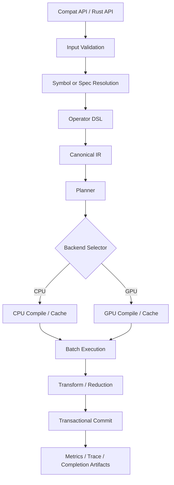

# Detailed Design Specification for a Rust-Native `libcint` Reimplementation
Document Type: Detailed Design Specification  
Version: 0.10  
Date: 2026-03-08  
Base Requirements: `libcint_rust_requirements_reviewed_v05.md`  
Language: English  
Target Audience: Lead architect, implementation engineers, performance engineers, QA, release managers

---

## 1. Purpose

This document defines the detailed design for a Rust-native reimplementation of `libcint`, based on the approved requirements baseline in `libcint_rust_requirements_reviewed_v05.md`.

The design is centered on the approved hybrid architecture:

- **typed operator DSL**
- **normalized canonical IR**
- **planner / batcher / screening**
- **backend abstraction**
- **CPU reference path**
- **CPU optimized path**
- **CubeCL GPU backend**
- **backend-independent transform layer**
- **libcint-compatible facade API**
- **differential-testing infrastructure against libcint**

The purpose of this document is to convert the requirements into an implementation-grade design with:

- concrete module boundaries
- source-tree structure
- trait contracts
- internal logic per module
- data ownership rules
- execution flow
- concurrency model
- error propagation rules
- observability points
- acceptance traceability

This is a design document, not an implementation guide for a single milestone. It describes the stable architectural target and the intended decomposition of the codebase.

---

## 2. Design Goals

The design shall satisfy the following engineering goals:

1. **Strict API-result compatibility**
   - The externally visible numerical behavior, shapes, ordering, and dispatch semantics must match the contractual expectations established by the requirements baseline and the libcint oracle.

2. **Backend-independent semantics**
   - Operator semantics, IR meaning, component ordering, transform rules, and optimizer contracts must not depend on CPU or GPU backend selection.

3. **Batch-first execution**
   - The primary execution model is task batching over shell tuples, not one-off scalar calls.

4. **Memory-budget-driven execution**
   - Planning, grouping, and splitting must be driven by memory budget and deterministic rules.

5. **Testability**
   - Every layer must expose enough structure to support differential tests, contract tests, planner fingerprint tests, and performance regression tests.

6. **Long-term maintainability**
   - Operator coverage must scale to the full public libcint surface without exploding handwritten kernel count or making the codebase unreviewable.

7. **Controlled performance specialization**
   - The architecture must permit specialized fast paths without contaminating the public API or the canonical semantics model.

---

## 3. Scope of This Design

This document covers:

- workspace/crate structure
- logical architecture
- external and internal APIs
- traits and module contracts
- canonical data model
- planner design
- CPU backend design
- CubeCL backend design
- transform pipeline
- optimizer lifecycle
- metrics, trace, and completion reporting
- test and benchmark architecture

This document does **not** attempt to fully derive individual mathematical recurrence formulas. Those belong to:

- operator semantics notes
- backend-specific kernel design notes
- per-family implementation notes

---

## 4. Architectural Principles

### 4.1 Layering Principle

The codebase is separated into the following layers:

1. **Surface layer**
   - `cint-compat`
   - public Rust-native API
   - libcint-compatible dispatch facade

2. **Semantic layer**
   - `cint-ops`
   - `cint-ir`
   - normalization, operator semantics, canonical representation

3. **Planning layer**
   - `cint-planner`
   - screening, grouping, split logic, plan generation

4. **Execution layer**
   - `cint-cpu`
   - `cint-cubecl`
   - backend-specific compilation and execution

5. **Post-processing layer**
   - `cint-transform`
   - representation conversion and output layout commitment

6. **Assurance layer**
   - `cint-testkit`
   - `cint-bench`
   - inventory, manifest validation, differential testing, metrics

### 4.2 Isolation Principle

- No public API may expose CubeCL-specific types.
- No backend may mutate operator semantics.
- No planner logic may depend on backend implementation internals beyond declared capability and cost contracts.
- No transform logic may depend on dispatch path.
- No optimizer handle may silently cross family, representation, or capability boundaries.

### 4.3 Monotonicity Principle

The following state transitions must be monotonic:

- symbol support status
- planner schema version usage
- release status
- error taxonomy coverage
- completion matrix population

A symbol may move forward in maturity; it may not regress silently.

---

## 5. System Context

At runtime, the system accepts either:

- libcint-compatible low-level arguments, or
- Rust-native normalized high-level inputs.

The system then:

1. validates and normalizes input
2. resolves the operator family and representation
3. builds canonical IR
4. enumerates shell tasks
5. applies screening and grouping
6. generates an execution plan under memory and backend constraints
7. compiles or fetches backend execution state
8. executes per planned batch
9. transforms results into requested representation and ordering
10. commits output according to API contract
11. records metrics, diagnostics, and fingerprints

---

## 6. Source Tree - Architecture Overview

```text
workspace/
├── Cargo.toml
├── rust-toolchain.toml
├── crates/
│   ├── cint-core/
│   │   ├── src/
│   │   │   ├── lib.rs
│   │   │   ├── error.rs
│   │   │   ├── ids.rs
│   │   │   ├── scalar.rs
│   │   │   ├── layout.rs
│   │   │   ├── tensor.rs
│   │   │   ├── workspace.rs
│   │   │   ├── metrics.rs
│   │   │   ├── trace.rs
│   │   │   ├── fingerprint.rs
│   │   │   ├── capability.rs
│   │   │   ├── backend.rs
│   │   │   └── lifecycle.rs
│   │   └── tests/
│   ├── cint-ops/
│   │   ├── src/
│   │   │   ├── lib.rs
│   │   │   ├── dsl.rs
│   │   │   ├── atoms.rs
│   │   │   ├── operators.rs
│   │   │   ├── registry.rs
│   │   │   ├── family.rs
│   │   │   └── parser.rs
│   │   └── tests/
│   ├── cint-ir/
│   │   ├── src/
│   │   │   ├── lib.rs
│   │   │   ├── normalize.rs
│   │   │   ├── model.rs
│   │   │   ├── canonical.rs
│   │   │   ├── symmetry.rs
│   │   │   ├── components.rs
│   │   │   └── fingerprint.rs
│   │   └── tests/
│   ├── cint-planner/
│   │   ├── src/
│   │   │   ├── lib.rs
│   │   │   ├── input.rs
│   │   │   ├── enumerate.rs
│   │   │   ├── screening.rs
│   │   │   ├── grouping.rs
│   │   │   ├── split.rs
│   │   │   ├── cost.rs
│   │   │   ├── plan.rs
│   │   │   ├── optimizer.rs
│   │   │   ├── report.rs
│   │   │   └── fingerprint.rs
│   │   └── tests/
│   ├── cint-cpu/
│   │   ├── src/
│   │   │   ├── lib.rs
│   │   │   ├── backend.rs
│   │   │   ├── reference/
│   │   │   │   ├── mod.rs
│   │   │   │   ├── kernels.rs
│   │   │   │   ├── recurrence.rs
│   │   │   │   ├── contract.rs
│   │   │   │   └── reduce.rs
│   │   │   ├── optimized/
│   │   │   │   ├── mod.rs
│   │   │   │   ├── simd.rs
│   │   │   │   ├── tiles.rs
│   │   │   │   ├── contract.rs
│   │   │   │   └── reduce.rs
│   │   │   ├── compile.rs
│   │   │   ├── dispatch.rs
│   │   │   └── workspace.rs
│   │   └── tests/
│   ├── cint-cubecl/
│   │   ├── src/
│   │   │   ├── lib.rs
│   │   │   ├── backend.rs
│   │   │   ├── capability.rs
│   │   │   ├── registry.rs
│   │   │   ├── compile.rs
│   │   │   ├── launch.rs
│   │   │   ├── transfer.rs
│   │   │   ├── workspace.rs
│   │   │   ├── kernels/
│   │   │   │   ├── mod.rs
│   │   │   │   ├── primitive.rs
│   │   │   │   ├── contract.rs
│   │   │   │   ├── transform.rs
│   │   │   │   └── reduce.rs
│   │   │   └── autotune.rs
│   │   └── tests/
│   ├── cint-transform/
│   │   ├── src/
│   │   │   ├── lib.rs
│   │   │   ├── cart.rs
│   │   │   ├── sph.rs
│   │   │   ├── spinor.rs
│   │   │   ├── ordering.rs
│   │   │   ├── reduce.rs
│   │   │   └── contract.rs
│   │   └── tests/
│   ├── cint-compat/
│   │   ├── src/
│   │   │   ├── lib.rs
│   │   │   ├── api.rs
│   │   │   ├── normalize.rs
│   │   │   ├── dispatch.rs
│   │   │   ├── symbols.rs
│   │   │   ├── optimizer.rs
│   │   │   └── output.rs
│   │   └── tests/
│   ├── cint-testkit/
│   │   ├── src/
│   │   │   ├── lib.rs
│   │   │   ├── oracle/
│   │   │   │   ├── mod.rs
│   │   │   │   ├── ffi.rs
│   │   │   │   └── runner.rs
│   │   │   ├── corpus.rs
│   │   │   ├── compare.rs
│   │   │   ├── manifests.rs
│   │   │   ├── completion.rs
│   │   │   ├── taxonomy.rs
│   │   │   └── reports.rs
│   │   └── tests/
│   └── cint-bench/
│       ├── src/
│       │   ├── lib.rs
│       │   ├── runner.rs
│       │   ├── baseline.rs
│       │   ├── protocol.rs
│       │   └── report.rs
│       └── tests/
├── tools/
│   ├── inventory-gen/
│   │   ├── src/main.rs
│   │   └── templates/
│   ├── manifest-lint/
│   │   └── src/main.rs
│   ├── plan-dump/
│   │   └── src/main.rs
│   └── completion-report/
│       └── src/main.rs
├── manifests/
│   ├── family_tiers.toml
│   ├── phase_targets.toml
│   ├── gpu_eligibility.toml
│   └── release_policy.toml
├── inventory/
│   ├── public_symbols.json
│   └── source_identity.json
├── tests/
│   ├── tolerances.toml
│   ├── corpus_manifest.toml
│   └── fixtures/
├── benchmarks/
│   ├── benchmark_manifest.toml
│   └── baseline.lock
├── reports/
│   ├── completion_matrix.json
│   ├── completion_matrix.md
│   └── error_taxonomy.json
└── docs/
    ├── detailed_design.md
    ├── math_notes/
    ├── backend_notes/
    └── release_notes/
```

### 6.1 Source Tree Rationale

- `crates/` contains runtime libraries.
- `tools/` contains operational tooling that updates authoritative artifacts.
- `manifests/`, `inventory/`, `tests/`, `benchmarks/`, and `reports/` are first-class governance artifacts, not incidental files.
- The tree is arranged so that semantic meaning (`ops`, `ir`) is separated from execution (`planner`, `cpu`, `cubecl`).

### 6.2 Dependency Direction

Allowed dependency flow:

```text
cint-compat
   ↓
cint-ops → cint-ir → cint-planner
   ↓         ↓          ↓
          cint-core ← cint-transform
             ↑         ↑
        cint-cpu   cint-cubecl
             ↑         ↑
         cint-testkit / cint-bench
```

Rules:

- `cint-core` depends on no execution crate.
- `cint-ir` depends on `cint-ops` and `cint-core`, not on planner or backend.
- `cint-planner` depends on `cint-ir` and `cint-core`, not on concrete backend crates.
- `cint-cpu` and `cint-cubecl` implement execution contracts defined in `cint-core`.
- `cint-transform` is backend-neutral.
- `cint-testkit` may depend on everything except tools.
- `tools/` may depend on library crates but no runtime crate depends on `tools/`.

---

## 7. End-to-End Execution Flow



Execution is split into three phases:

1. **semantic preparation**
2. **plan generation**
3. **backend execution and commit**

Each phase has independent diagnostics and error boundaries.

---

## 8. Cross-Module Contracts

### 8.1 Canonical Contract Objects

The following objects form the stable cross-module contract surface:

- `IntegralSpec`
- `NormalizedInput`
- `CanonicalIr`
- `ExecutionPlan`
- `PlannedBatch`
- `TaskDomain`
- `AnnotatedTask`
- `BackendSelector`
- `CapabilityProfile`
- `WorkspaceBudget`
- `WorkspaceSize`
- `WorkspaceEstimate`
- `ExplicitTaskResultMap`
- `BatchReport`
- `OptimizerHandle`
- `TensorViewMut`
- `OutputBuffer`
- `ExecStats`
- `PlanFingerprint`
- `DegradationReason`
- `SupportLevel`
- `ReleaseStatus`
- `CintError`

These types must be versioned carefully and may not accumulate backend-private fields.

### 8.2 Object Ownership Rules

- `IntegralSpec`, `BasisSet`, `Atoms`, and registry entries are immutable after creation.
- `Workspace` is explicitly mutable and must be uniquely owned during execution.
- `OptimizerHandle` may be shared only if it satisfies the documented trait bounds and invariant guarantees.
- `ExecutionPlan` is immutable once built.
- `CompiledPlan` is backend-private, immutable after compilation, and may be cached.

### 8.3 Commit Contract

- Low-level facade API:
  - no output mutation before successful plan construction
  - partial writes allowed only after execution begins, and only if documented

- High-level Rust API:
  - default mode is transactional commit
  - no visible mutation on failure
  - partial-write mode is explicit, opt-in, and separately typed

---

## 9. Canonical Data Model

### 9.1 Core Input Types

```rust
pub struct Atoms {
    pub z: Arc<[u32]>,
    pub coord_x: Arc<[f64]>,
    pub coord_y: Arc<[f64]>,
    pub coord_z: Arc<[f64]>,
}

pub struct Primitive {
    pub exponent: f64,
    pub coefficient: f64,
}

pub struct Shell {
    pub atom_index: u32,
    pub angular_momentum: u8,
    pub nprim: u16,
    pub nctr: u16,
    pub primitive_range: Range<u32>,
}

pub struct BasisSet {
    pub atoms: Atoms,
    pub shells: Arc<[Shell]>,
    pub exponents: Arc<[f64]>,
    pub coefficients: Arc<[f64]>,
}
```

### 9.2 SoA Requirement

For GPU readiness and planner efficiency, `BasisSet` must support conversion into a compact SoA representation:

- `shell_atom_index[]`
- `shell_l[]`
- `shell_nprim[]`
- `shell_nctr[]`
- `prim_exponents[]`
- `prim_coefficients[]`

The CPU backend may keep richer host-side forms, but the planner must not depend on backend-specific memory layout.

### 9.3 Integral Specification

```rust
pub struct IntegralSpec {
    pub family: FamilyId,
    pub representation: Representation,
    pub derivative_order: u8,
    pub operator_program: OperatorProgram,
    pub center_arity: CenterArity,
    pub electron_arity: ElectronArity,
    pub range_separation: Option<RangeSeparation>,
    pub component_policy: ComponentPolicy,
}
```

`IntegralSpec` is the high-level semantic specification shared across all paths.

### 9.4 Task Types

```rust
pub enum ShellTask {
    Pair { i: u32, j: u32 },
    Triple { i: u32, j: u32, k: u32 },
    Quartet { i: u32, j: u32, k: u32, l: u32 },
}
```

```rust
pub enum TaskDomain<'a> {
    FullBasis,
    Explicit(&'a [ShellTask]),
}
```

Task granularity is fixed at shell tuple level.
`TaskDomain` resolves the responsibility boundary between the surface API and the planner:

- `FullBasis` means the planner owns full task enumeration.
- `Explicit` means the caller provides a preselected task subset, but grouping, screening, and splitting remain planner-owned.
- For `Explicit`, caller order defines the user-visible logical order of the task axis. The planner may regroup internally for execution efficiency, but every explicit task must carry a stable logical index and the commit path must restore caller-visible order for all retained tasks. If screening drops explicit tasks, the reported task-result mapping must remain machine-readable, preserve relative order among retained tasks, and be surfaced through `BatchReport.explicit_task_result_map`.

```rust
pub struct AnnotatedTask {
    pub task: ShellTask,
    pub logical_index: u32,
    pub shell_l_tuple: SmallVec<[u8; 4]>,
    pub prim_bucket: SmallVec<[u16; 4]>,
    pub ctr_bucket: SmallVec<[u16; 4]>,
    pub recurrence_class: RecurrenceClass,
    pub representation: Representation,
    pub derivative_order: u8,
}
```

`AnnotatedTask` is the stable planner-internal task contract after enumeration and validation. It carries the caller-visible logical index, homogeneous grouping attributes, and the minimum metadata required for deterministic regrouping and output-order restoration.

### 9.5 Output Types

```rust
pub struct TensorShape {
    pub dims: SmallVec<[usize; 8]>,
}

pub struct TensorViewMut<'a, T> {
    pub ptr: NonNull<T>,
    pub shape: TensorShape,
    pub strides: SmallVec<[isize; 8]>,
    pub _marker: PhantomData<&'a mut T>,
}
```

The output layer must support both contiguous and strided layouts, but backend kernels should target canonical contiguous scratch layouts internally.

---

## 10. Module-by-Module Detailed Design

## 10.1 `cint-core`

### 10.1.1 Responsibility

`cint-core` defines the stable primitives shared across the workspace:

- error taxonomy
- backend traits
- metrics and tracing structures
- tensor layout types
- workspace abstractions
- capability types
- fingerprint schemas
- identifier types

It is the lowest-level crate and shall not depend on planner or execution crates.

### 10.1.2 Public Traits

#### `IntegralBackend`

```rust
pub trait IntegralBackend: Send + Sync {
    type Compiled: Send + Sync + 'static;
    type Device: Send + Sync + 'static;

    fn kind(&self) -> BackendKind;

    fn capability_profile(&self) -> CapabilityProfile;

    fn compile_plan(
        &self,
        plan: &ExecutionPlan,
    ) -> Result<Self::Compiled, BackendError>;

    fn workspace_size(
        &self,
        compiled: &Self::Compiled,
        batch: &PlannedBatch,
    ) -> Result<WorkspaceSize, BackendError>;

    fn execute_batch(
        &self,
        compiled: &Self::Compiled,
        batch: &PlannedBatch,
        workspace: &mut Workspace,
        out: &mut OutputBuffer,
        trace: &mut dyn TraceSink,
    ) -> Result<ExecStats, BackendError>;
}
```

#### `ErasedBackend`

Used by the high-level API for backend heterogeneity without generic explosion.

```rust
pub trait ErasedBackend: Send + Sync {
    fn kind(&self) -> BackendKind;
    fn capability_profile(&self) -> CapabilityProfile;
    fn compile_plan_erased(&self, plan: &ExecutionPlan) -> Result<Box<dyn CompiledPlan>, CintError>;
    fn workspace_size_erased(
        &self,
        compiled: &dyn CompiledPlan,
        batch: &PlannedBatch,
    ) -> Result<WorkspaceSize, CintError>;
    fn execute_batch_erased(
        &self,
        compiled: &dyn CompiledPlan,
        batch: &PlannedBatch,
        workspace: &mut Workspace,
        out: &mut OutputBuffer,
        trace: &mut dyn TraceSink,
    ) -> Result<ExecStats, CintError>;
}
```

#### `CompiledPlan`

```rust
pub trait CompiledPlan: Send + Sync {
    fn backend_kind(&self) -> BackendKind;
    fn plan_fingerprint(&self) -> &PlanFingerprint;
    fn workspace_class(&self) -> WorkspaceClass;
    fn as_any(&self) -> &dyn Any;
}
```

#### `TraceSink`

```rust
pub trait TraceSink {
    fn record_metric(&mut self, metric: MetricRecord);
    fn record_event(&mut self, event: TraceEvent);
    fn record_error_context(&mut self, error_ctx: ErrorContext);
}
```

#### `WorkspaceAllocator`

```rust
pub trait WorkspaceAllocator {
    fn allocate(&mut self, bytes: usize, align: usize) -> Result<WorkspaceSlice, CintError>;
    fn reset_epoch(&mut self);
    fn high_watermark_bytes(&self) -> usize;
}
```

#### Core Value Types

```rust
pub struct WorkspaceSize {
    pub required_logical_bytes: usize,
    pub required_staging_bytes: usize,
    pub alignment_bytes: usize,
}

pub struct WorkspaceEstimate {
    pub required_logical_bytes: usize,
    pub estimated_peak_transient_bytes: usize,
    pub required_staging_bytes: usize,
    pub estimated_alignment_bytes: usize,
}

pub struct TaskResultMapEntry {
    pub logical_index: u32,
    pub retained: bool,
    pub output_index: Option<u32>,
}

pub struct ExplicitTaskResultMap {
    pub entries: Arc<[TaskResultMapEntry]>,
}

pub struct OutputBuffer<'a> {
    pub cartesian_scratch: TensorViewMut<'a, f64>,
    pub public_staging: Option<TensorViewMut<'a, f64>>,
    pub explicit_task_result_map: Option<ExplicitTaskResultMap>,
}

pub struct BatchReport {
    pub requested_backend: BackendSelector,
    pub selected_backend: BackendKind,
    pub planner_fingerprint: PlanFingerprint,
    pub degradation_reasons: Arc<[DegradationReason]>,
    pub exec_stats: ExecStats,
    pub explicit_task_result_map: Option<ExplicitTaskResultMap>,
}
```

`WorkspaceSize` is the backend-compiled executable contract. `WorkspaceEstimate` is the planner-side advisory contract used for grouping, split admission, and reporting. `estimated_peak_transient_bytes` is an admission/reporting metric for peak-memory governance and must not be interpreted as a separately preallocated workspace field unless a future `WorkspaceSize` schema introduces an explicit transient allocation class. `ExplicitTaskResultMap` is the machine-readable output-order and drop-status contract for `TaskDomain::Explicit`. `OutputBuffer` is the stable execution-time staging contract between backends, transform, and commit logic. `BatchReport` is the high-level execution report returned by the Rust-native API.

### 10.1.3 Key Logic

- Define **strictly typed errors** for all public-facing failures.
- Provide a compact and serializable fingerprint schema.
- Represent backend capability as a stable value object rather than an implementation-specific query handle.
- Keep kernel registries backend-private; no registry object may leak through `cint-core` traits.
- Provide stable value types for `WorkspaceSize`, `WorkspaceEstimate`, `ExplicitTaskResultMap`, `BatchReport`, and `OutputBuffer` so planner, backends, transform, commit logic, and acceptance reporting use the same measurable contract.
- Keep allocation governance explicit: runtime workspace allocation is derived from backend-compiled `WorkspaceSize`, while `estimated_peak_transient_bytes` remains a planner/reporting metric used for split admission and memory-governance checks unless and until the executable workspace schema is extended.
- Provide an erased workspace-size query so the dynamic engine path can validate planner estimates against backend-compiled requirements without downcasting.
- Require `CompiledPlan` to expose a type-safe erased downcast surface (`as_any`) so erased backends can validate ownership and concrete handle type before execution.
- Require erased backend methods to validate compiled-handle ownership and type compatibility before use, returning a typed `CompiledPlanMismatch` error rather than panicking or relying on unchecked downcasts.
- Provide output-buffer helpers used by transactional commit logic in higher layers.

### 10.1.4 Invariants

- No opaque catch-all error may cross public crate boundaries.
- `PlanFingerprint` must include schema version.
- `CapabilityProfile` must be deterministic and comparable.
- `CompiledPlan` must provide a stable type-erased inspection surface sufficient for safe backend-side ownership/type validation.
- `ErasedBackend` methods must reject foreign or incompatible `CompiledPlan` handles with `CintError::CompiledPlanMismatch`; panic, UB, or unchecked type assumptions are forbidden.
- `Workspace` metrics must separate logical bytes, staging bytes, alignment bytes, planner-estimated peak transient bytes, and measured peak bytes.
- Actual workspace allocation must be driven by compiled `WorkspaceSize`; planner transient estimates may influence admission and reporting but may not silently create undeclared allocator fields.

### 10.1.5 Internal Logic Notes

- `Workspace` is implemented as an arena-like allocation model with epoch reset.
- The allocator exposes raw slices internally but only typed wrappers externally.
- High-water mark tracking is mandatory for memory reporting.

---

## 10.2 `cint-ops`

### 10.2.1 Responsibility

`cint-ops` owns:

- the typed operator DSL
- operator atom definitions
- family metadata
- symbol-to-family mapping
- registry lookup
- parser/bridge logic from symbol names to operator programs

It is the semantic entry point for all operator meaning.

### 10.2.2 Public Traits

#### `OperatorRegistry`

```rust
pub trait OperatorRegistry: Send + Sync {
    fn resolve_symbol(&self, symbol: &str) -> Option<RegistryEntry>;
    fn resolve_family(&self, family: FamilyId) -> Option<FamilyDescriptor>;
    fn iter_families(&self) -> Box<dyn Iterator<Item = FamilyDescriptor> + '_>;
    fn iter_symbols(&self) -> Box<dyn Iterator<Item = RegistryEntry> + '_>;
}
```

#### `OperatorProgramBuilder`

```rust
pub trait OperatorProgramBuilder {
    fn push_atom(&mut self, atom: OperatorAtom) -> Result<(), DslError>;
    fn set_representation(&mut self, repr: Representation);
    fn set_derivative_order(&mut self, order: u8);
    fn build(self) -> Result<OperatorProgram, DslError>;
}
```

### 10.2.3 Key Types

```rust
pub enum OperatorAtom {
    Position(PositionAxis),
    RelativeCenter(RelativeCenterKind),
    Nabla,
    Dot,
    Cross,
    G,
    Sigma,
    RinV,
    Nuc,
    Gaunt,
    Breit,
    RangeSeparated(f64),
    CompositeBegin,
    CompositeEnd,
}
```

```rust
pub struct RegistryEntry {
    pub symbol: SymbolId,
    pub family: FamilyId,
    pub kind: SymbolKind,
    pub tier: Tier,
    pub default_representation: Representation,
    pub operator_program: OperatorProgram,
}
```

### 10.2.4 Key Logic

1. Parse the symbol or family selection into a strongly typed `OperatorProgram`.
2. Attach metadata from inventory and manifest sources, including the generated runtime release policy used by backend selection.
3. Reject illegal operator compositions early.
4. Preserve a many-to-one mapping from public symbol identity to semantic family identity: each public symbol maps to exactly one family, and no symbol may resolve to multiple families.

### 10.2.5 Invariants

- Every public symbol from `inventory/public_symbols.json` must map to exactly one family.
- Every mapped family must have one canonical DSL form.
- Registry build must fail on:
  - duplicate symbol
  - duplicate family root
  - missing tier assignment
  - illegal representation policy

### 10.2.6 Internal Logic Notes

- The registry is built at startup from generated Rust tables, not parsed ad hoc per request.
- Generated tables come from the inventory tool chain so the registry is reproducible.
- Family descriptors are immutable and thread-safe.

---

## 10.3 `cint-ir`

### 10.3.1 Responsibility

`cint-ir` translates the DSL into a canonical, backend-independent intermediate representation.

It owns:

- canonicalization rules
- symmetry normalization
- component enumeration rules
- transform requirements
- IR fingerprinting

### 10.3.2 Public Traits

#### `IrNormalizer`

```rust
pub trait IrNormalizer: Send + Sync {
    fn normalize(&self, program: &OperatorProgram, spec: &IntegralSpec) -> Result<CanonicalIr, CintError>;
}
```

#### `ComponentResolver`

```rust
pub trait ComponentResolver {
    fn component_count(&self, ir: &CanonicalIr) -> usize;
    fn component_ordering(&self, ir: &CanonicalIr) -> ComponentOrdering;
    fn transform_requirement(&self, ir: &CanonicalIr) -> TransformRequirement;
}
```

### 10.3.3 Core IR Model

```rust
pub struct CanonicalIr {
    pub family: FamilyId,
    pub electron_arity: ElectronArity,
    pub center_arity: CenterArity,
    pub derivative_order: u8,
    pub representation: Representation,
    pub operators: Arc<[CanonicalOp]>,
    pub component_count: usize,
    pub symmetry: SymmetryInfo,
    pub transform_requirement: TransformRequirement,
    pub range_separation: Option<RangeSeparation>,
    pub ir_fingerprint: IrFingerprint,
}
```

### 10.3.4 Key Logic

- Normalize equivalent operator sequences to the same IR.
- Compute transform requirements without binding to any specific backend.
- Separate semantic ordering from backend storage ordering.
- Produce a deterministic fingerprint used by the planner and reporting layers.

### 10.3.5 Canonicalization Rules

Examples:

- equivalent operator sequences collapse to the same canonical order
- derivative metadata is normalized into explicit order fields
- representation requests are normalized even when the internal evaluation basis is cartesian
- family-specific ordering ambiguities are resolved centrally here, not in backends

### 10.3.6 Invariants

- Canonicalization must be deterministic.
- Any backend-visible component ordering must be derivable from IR only.
- `CanonicalIr` must not contain backend-private optimization hints.

---

## 10.4 `cint-planner`

### 10.4.1 Responsibility

`cint-planner` converts normalized input and canonical IR into backend-executable plans.

It owns:

- shell task enumeration
- screening
- homogeneous grouping
- memory-budget-based split logic
- optimizer compatibility checks
- degradation reason generation
- planner fingerprint generation
- plan reporting

### 10.4.2 Public Traits

#### `Planner`

```rust
pub trait Planner: Send + Sync {
    fn build_plan(&self, input: &PlannerInput) -> Result<ExecutionPlan, CintError>;
}
```

#### `TaskEnumerator`

```rust
pub trait TaskEnumerator {
    fn enumerate<'a>(
        &self,
        basis: &'a BasisSet,
        spec: &'a IntegralSpec,
        domain: &'a TaskDomain<'a>,
    ) -> TaskStream<'a>;
}
```

#### `ScreeningPolicy`

```rust
pub trait ScreeningPolicy: Send + Sync {
    fn evaluate(&self, task: &ShellTask, ctx: &ScreeningContext) -> ScreeningDecision;
}
```

#### `GroupingPolicy`

```rust
pub trait GroupingPolicy: Send + Sync {
    fn key_for(&self, task: &AnnotatedTask) -> GroupKey;
}
```

#### `SplitPolicy`

```rust
pub trait SplitPolicy: Send + Sync {
    fn split(
        &self,
        grouped: GroupedTasks,
        budget: WorkspaceBudget,
        estimate: &dyn WorkspaceEstimator,
    ) -> Vec<PlannedBatch>;
}
```

#### `WorkspaceEstimator`

```rust
pub trait WorkspaceEstimator: Send + Sync {
    fn estimate_batch(&self, batch: &CandidateBatch, backend: BackendClass) -> WorkspaceEstimate;
}
```

### 10.4.3 Core Types

```rust
pub struct PlannerInput<'a> {
    pub spec: &'a IntegralSpec,
    pub basis: &'a BasisSet,
    pub task_domain: TaskDomain<'a>,
    pub cfg: &'a BatchConfig,
    pub selector: BackendSelector,
    pub capability: CapabilityProfile,
    pub optimizer: Option<&'a OptimizerHandle>,
}

pub struct ExecutionPlan {
    pub ir: CanonicalIr,
    pub backend_class: BackendClass,
    pub batches: Arc<[PlannedBatch]>,
    pub workspace_estimate: WorkspaceEstimate,
    pub transform_requirement: TransformRequirement,
    pub deterministic: bool,
    pub degradation_reasons: Arc<[DegradationReason]>,
    pub fingerprint: PlanFingerprint,
}
```

```rust
pub type TaskStream<'a> = Box<dyn Iterator<Item = ShellTask> + Send + 'a>;

pub struct CandidateBatch {
    pub key: GroupKey,
    pub tasks: Arc<[AnnotatedTask]>,
}

pub struct GroupedTasks {
    pub key: GroupKey,
    pub tasks: Arc<[AnnotatedTask]>,
}
```

### 10.4.4 Planner Logic

#### Step 1: Task Enumeration
- Determine the shell tuple arity from `IntegralSpec`.
- If `task_domain=FullBasis`, enumerate legal shell tuple combinations.
- If `task_domain=Explicit`, validate tuple arity and bounds, preserve caller order as the pre-screen order, attach stable logical indices, and skip full-domain generation.
- Optionally apply symmetry reduction for families that allow it and only when it is legal for the selected domain; any such reduction must preserve the caller-visible ordering contract for retained explicit tasks.

#### Step 2: Annotation
- Annotate each task with:
  - shell angular momenta
  - primitive count bucket
  - contraction count bucket
  - estimated Rys order or recurrence class
  - representation class
  - derivative class

#### Step 3: Screening
- Apply screening policy.
- Record kept vs dropped counts.
- For `TaskDomain::Explicit`, populate retained/drop status in the explicit-task result map while preserving stable logical indices.
- Record threshold and screening ratio metrics.

#### Step 4: Homogeneous Grouping
Group by a backend-stable homogeneous key, at minimum:

- family
- representation
- derivative order
- shell angular momentum tuple
- primitive count bucket
- contraction count bucket
- recurrence class / quadrature class
- transform requirement

#### Step 5: Backend Selection
Given `BackendSelector`, `CapabilityProfile`, configured backend inventory, `gpu_eligibility.toml`, and the generated runtime release policy artifact:

- resolve actual backend class
- emit degradation reason on CPU fallback
- reject silent fallback for `RequireGpu`
- treat GPU execution as permitted only when a GPU backend is configured, capability reports GPU availability, and the runtime release policy contains an explicit allow entry for the resolved symbol/backend class
- reject `RequireGpu` when the GPU backend is not configured, capability is insufficient, or the resolved symbol lacks an explicit GPU-allow entry in the runtime release policy artifact

#### Step 6: Workspace Estimation
Estimate logical workspace, staging workspace, alignment overhead, and expected transient usage. `estimated_peak_transient_bytes` is a split-admission/reporting metric, not an executable allocation field in the current `WorkspaceSize` schema.

#### Step 7: Splitting
Split large groups into executable batches according to:

- `max_tasks`
- `max_workspace_bytes`
- backend-specific occupancy constraints
- deterministic ordering requirements

#### Step 8: Fingerprinting and Reporting
Generate plan fingerprint over:

- IR fingerprint
- batch config
- grouping policy version
- split policy version
- backend class
- planner schema version
- optimizer compatibility fingerprint
- source identity digest

### 10.4.5 Invariants

- Same input and same deterministic config must yield identical batch order and fingerprint.
- Any CPU fallback in `Auto` mode must produce a machine-readable degradation reason.
- `RequireGpu` must fail if the symbol is not GPU-eligible, no GPU backend is configured, the generated runtime release policy artifact lacks an explicit GPU-allow entry for the resolved symbol/backend class, or capability is insufficient.
- Planner workspace estimation is advisory for batching and reporting; executable workspace must be revalidated against the compiled backend contract before batch execution begins.
- Planner must compare workspace using explicit named byte metrics (`required_logical_bytes`, `required_staging_bytes`, `estimated_peak_transient_bytes`, and `estimated_alignment_bytes`) and may not compare opaque estimate objects directly to budget limits.
- Runtime allocation must consume the compiled `WorkspaceSize` contract; `estimated_peak_transient_bytes` may gate admission and reporting but shall not be double-counted as an implicit allocator input.
- Planner must not directly call backend compile/execute functions.

### 10.4.6 Optimizer Submodule

The planner owns optimizer compatibility checks because reuse correctness depends on planned semantics.

#### `OptimizerHandle`

```rust
pub struct OptimizerHandle {
    pub family: FamilyId,
    pub representation: Representation,
    pub basis_fingerprint: BasisFingerprint,
    pub spec_fingerprint: SpecFingerprint,
    pub planner_schema: u32,
    pub backend_independent_cache: Arc<OptimizerCache>,
}
```

#### Optimizer Logic

- verify family match
- verify representation match
- verify basis fingerprint match
- verify planner schema compatibility
- expose backend-neutral cached screening/index data
- forbid accidental reuse across incompatible specs

If incompatible, return `OptimizerMismatch`.

---

## 10.5 `cint-cpu`

### 10.5.1 Responsibility

`cint-cpu` implements CPU execution in two modes:

- **reference path**
- **optimized path**

The reference path is the internal correctness anchor.  
The optimized path is the high-performance CPU path.

### 10.5.2 Public Traits

`cint-cpu` implements `IntegralBackend` and `ErasedBackend`.

Internally it also defines:

#### `CpuKernelProvider`

```rust
pub trait CpuKernelProvider: Send + Sync {
    fn lookup(&self, key: &CpuKernelKey) -> Option<CpuKernelHandle>;
}
```

#### `CpuExecutionContract`

```rust
pub trait CpuExecutionContract {
    fn required_workspace(&self, batch: &PlannedBatch) -> WorkspaceSize;
    fn execute_cartesian(
        &self,
        batch: &PlannedBatch,
        workspace: &mut CpuWorkspace,
        out: &mut [f64],
    ) -> Result<ExecStats, BackendError>;
}
```

### 10.5.3 Internal Structure

- `reference/`
  - mathematically conservative path
  - explicit, readable recurrence and contraction
  - minimal specialization
  - deterministic reduction order

- `optimized/`
  - vectorization
  - tile scheduling
  - contraction fusion
  - optional loop unrolling
  - layout-specific fast paths

### 10.5.4 Reference Path Logic

The reference path shall:

1. load a planned batch
2. allocate deterministic scratch
3. evaluate primitive recurrence or quadrature loops
4. contract primitive contributions
5. accumulate in canonical cartesian component order
6. hand off to transform layer if needed
7. return stable statistics

The reference path must prioritize:

- readability
- reproducibility
- numerical stability
- ease of comparison against libcint

### 10.5.5 Optimized Path Logic

The optimized path may:

- reorder local loops for cache friendliness
- use SIMD reductions
- tile over shell tuples
- fuse contraction with partial transform
- specialize by homogeneous key

But it may **not** change:

- public component ordering
- tolerance contract
- optimizer semantics
- planner-visible workspace contract

### 10.5.6 CPU Compilation Model

Unlike GPU compilation, CPU “compile” mainly means:

- selecting kernel handle
- preparing local dispatch metadata
- choosing vector width
- validating support class
- creating compiled execution object

### 10.5.7 Invariants

- The reference path is always available for any supported CPU symbol.
- The optimized path must be differential-tested against the reference path.
- SIMD enable/disable must not change semantics beyond tolerance.
- If an optimized kernel is unavailable, CPU backend may fall back to reference path internally, but must preserve traceability.

---

## 10.6 `cint-cubecl`

### 10.6.1 Responsibility

`cint-cubecl` implements the GPU backend using CubeCL while hiding CubeCL-specific details behind backend traits.

It owns:

- capability detection
- kernel registry
- compile/cache strategy
- host-device transfer policy
- workspace staging
- batch launch orchestration
- autotune integration

### 10.6.2 Public Traits

It implements `IntegralBackend` and `ErasedBackend`.

Internal traits:

#### `GpuKernelRegistry`

```rust
pub trait GpuKernelRegistry: Send + Sync {
    fn kernel_for(&self, key: &GpuKernelKey) -> Option<GpuKernelDescriptor>;
}
```

#### `CapabilityProbe`

```rust
pub trait CapabilityProbe {
    fn probe(&self) -> CapabilityProfile;
}
```

#### `LaunchPolicy`

```rust
pub trait LaunchPolicy: Send + Sync {
    fn launch_shape(&self, batch: &PlannedBatch, kernel: &GpuKernelDescriptor) -> LaunchShape;
}
```

### 10.6.3 GPU Execution Model

The GPU backend uses a **homogeneous batch execution model**:

- each planned batch is homogeneous by kernel-relevant attributes
- the planner ensures divergence-minimized grouping
- kernels operate on compact descriptors and SoA basis data
- transform/reduction may be:
  - fused for selected kernels
  - separate for generic kernels

### 10.6.4 Compile Logic

`compile_plan()` shall:

1. validate GPU eligibility manifest
2. validate capability profile
3. consult the backend-private kernel registry for each homogeneous batch class
4. materialize or fetch compiled kernel objects
5. create backend-private launch metadata
6. record cold compile statistics

### 10.6.5 Execute Logic

`execute_batch()` shall:

1. prepare or reuse device staging buffers
2. upload task descriptors as needed
3. upload or reuse basis SoA buffers
4. launch primitive/reduction/transform kernels
5. synchronize according to configured mode
6. download or map output into staging
7. expose warm execution timing separately from cold compile timing
8. if runtime capability or launch preconditions invalidate the compiled path, return a typed execution/capability error; backend-internal CPU fallback is forbidden

### 10.6.6 Kernel Types

The initial kernel taxonomy is:

- primitive evaluation kernel
- contraction/reduction kernel
- transform kernel
- optional fused primitive+contraction kernel

### 10.6.7 Invariants

- No silent CPU fallback for `RequireGpu`.
- No backend-internal CPU fallback is permitted during `execute_batch()`; any post-compile invalidation must surface as a typed error and preserve previously recorded planner selection state.
- No symbol may run on GPU unless marked GPU-eligible and backed by a kernel registry entry.
- Kernel registry and eligibility manifest must remain consistent.
- Capability mismatch must fail fast before launch.

### 10.6.8 Autotune Logic

Autotune is backend-private and may optimize:

- tile sizes
- workgroup shapes
- vector widths
- split preferences
- fused vs unfused transform

Autotune results may affect performance but may not alter planner fingerprint schema without a version bump.

---

## 10.7 `cint-transform`

### 10.7.1 Responsibility

`cint-transform` owns post-evaluation representation conversion and output ordering semantics.

It owns:

- cartesian ordering rules
- cartesian → spherical transforms
- cartesian → spinor transforms
- backend-neutral reduction helpers
- output component-order contracts

### 10.7.2 Public Traits

#### `TransformEngine`

```rust
pub trait TransformEngine: Send + Sync {
    fn transform(
        &self,
        repr: Representation,
        input: &CartesianBlock,
        output: &mut RepresentationBlock,
    ) -> Result<(), CintError>;
}
```

#### `OrderingContract`

```rust
pub trait OrderingContract {
    fn canonical_cartesian_order(&self, l: u8) -> ComponentOrdering;
    fn public_order(&self, repr: Representation, l: u8) -> ComponentOrdering;
}
```

### 10.7.3 Key Logic

- The canonical internal accumulation format is cartesian unless a family-specific design note explicitly approves otherwise.
- Transform matrices are immutable, precomputed, and cached by `l` and representation.
- Ordering conversion is applied centrally here, not inside each backend kernel, unless a backend has a proven fused implementation that is verified against this layer.

### 10.7.4 Invariants

- Transform semantics are backend-independent.
- Public component ordering must be identical across CPU and GPU.
- Representation mismatch must be detectable via contract tests.

---

## 10.8 `cint-compat`

### 10.8.1 Responsibility

`cint-compat` provides the libcint-compatible surface and symbol dispatch facade.

It owns:

- symbol dispatch API
- low-level input validation
- normalization from libcint arrays into internal model
- compat optimizer handle bridge
- low-level output shape and dims handling

### 10.8.2 Public Traits

`cint-compat` is mostly a surface crate, but internally exposes:

#### `CompatNormalizer`

```rust
pub trait CompatNormalizer {
    fn normalize(
        &self,
        symbol: SymbolId,
        shls: &[usize],
        atm: &[i32],
        bas: &[i32],
        env: &[f64],
    ) -> Result<NormalizedInput, CintError>;
}
```

#### `CompatDispatcher`

```rust
pub trait CompatDispatcher {
    fn dispatch(
        &self,
        symbol: SymbolId,
        input: &NormalizedInput,
        out: &mut [f64],
        dims: Option<&mut [usize]>,
        opt: Option<&CompatOptimizerHandle>,
        cache: Option<&mut Workspace>,
    ) -> Result<NonZeroFlag, CintError>;
}
```

### 10.8.3 Key Logic

1. Validate raw array ranges and dimensions.
2. Resolve symbol identity from generated symbol tables.
3. Convert `atm`, `bas`, `env`, `shls` into internal `BasisSet`, `IntegralSpec`, and task batch.
4. Bridge compat optimizer handles into `OptimizerHandle`.
5. Execute through planner + backend stack.
6. Commit dims and output according to low-level contract.
7. For explicit task subsets, preserve caller-visible logical task ordering in the emitted output contract.

### 10.8.4 Compat Input Model Notes

- Unsafe or invalid raw pointer access is isolated to a narrow boundary.
- After normalization, all downstream logic uses safe Rust structures.
- Any façade function must map to a single canonical symbol entry.

### 10.8.5 Invariants

- No panic on invalid user input.
- No mutation of output before successful planning.
- Symbol dispatch mismatch is a fatal build-time or startup-time error.

---

## 10.9 `cint-testkit`

### 10.9.1 Responsibility

`cint-testkit` implements the assurance layer.

It owns:

- libcint oracle FFI
- differential runners
- corpus loading
- tolerance resolution
- manifest validation
- completion matrix generation
- taxonomy checks
- consistency suites

### 10.9.2 Public Traits

#### `OracleRunner`

```rust
pub trait OracleRunner {
    fn run_case(&self, case: &TestCase) -> Result<OracleResult, anyhow::Error>;
}
```

#### `ToleranceResolver`

```rust
pub trait ToleranceResolver {
    fn resolve(&self, case: &TestCaseMeta) -> ToleranceRule;
}
```

#### `CompletionReporter`

```rust
pub trait CompletionReporter {
    fn update_symbol(&mut self, result: VerificationRecord);
    fn emit_json(&self) -> serde_json::Value;
    fn emit_markdown(&self) -> String;
}
```

### 10.9.3 Key Logic

- Load authoritative inventory and manifests.
- Cross-validate symbol coverage, family mapping, tier, phase, eligibility, and support-state invariants.
- Build test cases from corpus manifests.
- Execute implementation-under-test and libcint oracle.
- Compare outputs under resolved tolerance profile.
- Populate completion matrix and error taxonomy reports.
- Emit a machine-generated `manifests/release_policy.toml` artifact derived from verification evidence for runtime backend-selection enforcement.
- Reject non-monotonic support-state transitions unless the recorded release status is `TemporarilyWithdrawn` with an issue reference.

### 10.9.4 Invariants

- The oracle path is test-only and must not leak into runtime crates.
- Tolerance precedence must be deterministic.
- Completion matrix must be generated from machine-collected evidence, not by hand.
- Support level and release status must be derivable from authoritative artifacts and verification evidence only.

### 10.9.5 Support-State Reporting Logic

`cint-testkit` is the owning module for support-state normalization.
It shall derive `SupportLevel` and `ReleaseStatus` from authoritative artifacts plus observed verification evidence; runtime crates may emit evidence but may not assign release states directly.

```rust
pub enum SupportLevel {
    Mapped,
    Planned,
    CpuVerified,
    GpuVerified,
    OptimizerVerified,
}

pub enum ReleaseStatus {
    NotReleased,
    ReleasedCpuOnly,
    ReleasedHybrid,
    ReleasedWithKnownLimitation,
    TemporarilyWithdrawn,
}
```

The normalized state machine shall implement the monotonic transition rules defined by the requirements baseline, including the special withdrawal path for `TemporarilyWithdrawn`. The same evidence pipeline shall emit the runtime release-policy artifact consumed by the planner; support-state reporting and runtime release-policy generation must therefore be derived from the same authoritative evidence set.

---

## 10.10 `cint-bench`

### 10.10.1 Responsibility

`cint-bench` implements the benchmark governance layer.

It owns:

- benchmark protocol enforcement
- run statistics
- baseline lock generation
- regression comparison
- hardware-class fingerprinting

### 10.10.2 Public Traits

#### `BenchmarkRunner`

```rust
pub trait BenchmarkRunner {
    fn run_suite(&self, manifest: &BenchmarkManifest) -> anyhow::Result<BenchmarkReport>;
}
```

#### `BaselineManager`

```rust
pub trait BaselineManager {
    fn compare(&self, current: &BenchmarkReport, baseline: &BaselineLock) -> RegressionReport;
    fn update(&self, current: &BenchmarkReport) -> anyhow::Result<BaselineLock>;
}
```

### 10.10.3 Key Logic

- Enforce the benchmark protocol from the requirements baseline:
  - warmup: 5 runs
  - measured: 30 or more runs
  - baseline lock generation: 3 independent valid runs, with locked statistics generated from the per-metric median across those runs
- Record build, hardware, runtime, seed, corpus, batch configuration, and planner schema fingerprints.
- Emit p50/p95/min/max/mean/stddev/CV.
- Split CPU and GPU reporting into valid categories, including cold compile vs warm execution for GPU.
- Reject invalid baseline updates.

### 10.10.4 Invariants

- A benchmark run with `CV > 0.10` is not baseline-eligible.
- A valid benchmark run requires at least 90% successful measured runs.
- A baseline update requires explicit operator action.
- Hardware-class mismatch invalidates strict comparison.

---

## 11. Trait Design Summary

The following traits form the stable architectural backbone:

| Trait | Crate | Role |
|---|---|---|
| `IntegralBackend` | `cint-core` | Backend execution contract |
| `ErasedBackend` | `cint-core` | Dynamic backend dispatch |
| `CompiledPlan` | `cint-core` | Backend-private compiled handle abstraction |
| `TraceSink` | `cint-core` | Metrics and diagnostics sink |
| `WorkspaceAllocator` | `cint-core` | Workspace memory contract |
| `OperatorRegistry` | `cint-ops` | Symbol/family registry |
| `OperatorProgramBuilder` | `cint-ops` | DSL builder |
| `IrNormalizer` | `cint-ir` | DSL → canonical IR |
| `ComponentResolver` | `cint-ir` | Component count/ordering/transform contract |
| `Planner` | `cint-planner` | Plan generation |
| `TaskEnumerator` | `cint-planner` | Shell task enumeration |
| `ScreeningPolicy` | `cint-planner` | Screening decision |
| `GroupingPolicy` | `cint-planner` | Homogeneous grouping |
| `SplitPolicy` | `cint-planner` | Batch split logic |
| `WorkspaceEstimator` | `cint-planner` | Workspace cost estimation |
| `CpuKernelProvider` | `cint-cpu` | CPU kernel registry |
| `CpuExecutionContract` | `cint-cpu` | CPU kernel execution contract |
| `GpuKernelRegistry` | `cint-cubecl` | GPU kernel registry |
| `CapabilityProbe` | `cint-cubecl` | GPU capability detection |
| `LaunchPolicy` | `cint-cubecl` | GPU launch-shape derivation |
| `TransformEngine` | `cint-transform` | Representation transform |
| `OrderingContract` | `cint-transform` | Public ordering rules |
| `CompatNormalizer` | `cint-compat` | libcint input normalization |
| `CompatDispatcher` | `cint-compat` | libcint-compatible dispatch |
| `OracleRunner` | `cint-testkit` | libcint oracle execution |
| `ToleranceResolver` | `cint-testkit` | tolerance resolution |
| `CompletionReporter` | `cint-testkit` | completion matrix generation |
| `BenchmarkRunner` | `cint-bench` | benchmark execution |
| `BaselineManager` | `cint-bench` | regression/baseline governance |

---

## 12. Detailed Logic by Concern

## 12.1 Symbol Resolution Logic

1. Resolve function symbol from generated symbol table.
2. Load `RegistryEntry`.
3. Confirm symbol kind:
   - numerical
   - optimizer
4. Bind family metadata and tier.
5. Attach default representation and component policy.
6. Reject unregistered symbol at the compat boundary.

This logic lives primarily in `cint-ops` and `cint-compat`.

## 12.2 Normalization Logic

Normalization converts external input into the canonical internal form.

### Compat Path
- parse raw arrays
- validate bounds
- build `Atoms` and `BasisSet`
- infer `IntegralSpec`
- create `TaskDomain` (`FullBasis` or validated explicit tuple subset)

### Rust-native Path
- validate user-owned typed structures
- derive `OperatorProgram`
- normalize into `IntegralSpec` and `CanonicalIr`

Normalization must guarantee that all downstream layers operate on safe, immutable structures.

## 12.3 Screening Logic

Screening is planner-owned and must remain backend-independent.

The default screening flow is:

1. load task-local shell metadata
2. compute screening estimate
3. compare against threshold
4. emit keep/drop decision
5. record screening metrics

The actual screening heuristic may evolve, but the observable contract remains:

- result equivalence within tolerance
- measurable screen ratio
- deterministic behavior in deterministic mode

## 12.4 Grouping Logic

Grouping creates homogeneous batches that minimize divergence and maximize cache reuse.

The grouping key must remain stable and serializable. It should not include ephemeral values like pointer addresses.

Suggested grouping key fields:

```rust
pub struct GroupKey {
    pub family: FamilyId,
    pub repr: Representation,
    pub derivative_order: u8,
    pub shell_l_tuple: SmallVec<[u8; 4]>,
    pub prim_bucket: SmallVec<[u16; 4]>,
    pub ctr_bucket: SmallVec<[u16; 4]>,
    pub recurrence_class: RecurrenceClass,
    pub transform_requirement: TransformRequirement,
}
```

## 12.5 Split Logic

Split logic enforces budget and execution practicality.

Pseudo-flow:

```text
for group in grouped_tasks:
    candidate = group.to_candidate_batch()
    estimate = workspace_estimator.estimate_batch(candidate, backend_class)
    required_budget_bytes =
        estimate.required_logical_bytes
        + estimate.required_staging_bytes
        + estimate.estimated_peak_transient_bytes
        + estimate.estimated_alignment_bytes
    if required_budget_bytes <= budget.max_workspace_bytes and candidate.tasks.len() <= budget.max_tasks:
        emit batch
    else:
        recursively or iteratively split group
        annotate split reason
```

Split must preserve order determinism when `deterministic=true`. The transient-byte term is part of admission/governance math; actual allocator sizing remains derived from compiled `WorkspaceSize`.

## 12.6 Backend Selection Logic

Algorithm:

1. Load `BackendSelector`.
2. If `RequireCpu`, select CPU.
3. Else if `RequireGpu`:
   - verify that a GPU backend is configured in the engine; otherwise return `CintError::BackendUnavailable`
   - verify GPU eligibility
   - verify that the generated runtime release policy artifact explicitly allows GPU for the resolved symbol/backend class; otherwise return `CintError::ReleasePolicyDenied`
   - verify capability profile; insufficient device capability maps to `CintError::CapabilityMismatch`
   - select GPU or fail with the corresponding typed error
4. Else if `Auto`:
   - apply the versioned backend-selection policy
   - if the policy resolves to GPU, require a configured GPU backend, eligibility, an explicit GPU-allow entry in the generated runtime release policy artifact, and sufficient capability
   - otherwise select CPU and, when GPU was preferred by policy but not permitted or not configured, emit a machine-readable degradation reason; `Auto` does not surface `ReleasePolicyDenied` because the contract is successful degradation to CPU, not hard failure

This logic is planner-owned because selection affects plan shape and reporting. The release-policy input must be a generated runtime artifact, not a handwritten override in runtime code. `Auto` is policy-driven and must be deterministic for the same input, configured backend inventory, capability profile, release-policy artifact, and planner schema. If future cost heuristics are added, they must be versioned, reflected in the planner fingerprint, and covered by acceptance tests; ad hoc runtime self-tuning may not change backend choice silently. The typed-error mapping for backend selection is part of the public contract and shall be covered by contract tests.

## 12.7 Transactional Commit Logic

The high-level API uses staging output:

1. allocate staging output compatible with canonical internal shape
2. execute all batches into staging
3. apply transforms/order adjustments
4. validate final dims and shape
5. copy or map into user-visible output
6. for `TaskDomain::Explicit`, restore caller-visible logical task ordering using the stable logical indices carried through planning and execution, and finalize `BatchReport.explicit_task_result_map`
7. publish metrics, including transactional-overhead measurements

If any step fails before final commit, user-visible output remains unchanged. `Engine::compute()` is therefore the transactional API. Any partial-write high-level path must be exposed as a separate opt-in API and must not share the same method signature or failure contract. Transactional overhead shall be measured per case as `allocated_staging_plus_commit_bytes / logical_output_bytes`; Phase 2 and later representative-corpus runs must satisfy the requirements-baseline gates (95th percentile <= 1.25x, maximum <= 1.50x).

## 12.8 Optimizer Lifecycle Logic

Optimizer lifecycle:

1. build
2. fingerprint
3. validate on use
4. reuse or reject
5. destroy or allow drop

The planner is responsible for validating optimizer compatibility before execution.

---

## 13. Error Design

### 13.1 Public Error Taxonomy

```rust
#[derive(thiserror::Error, Debug)]
pub enum CintError {
    #[error("invalid input: {0}")]
    InvalidInput(String),

    #[error("unsupported operator: {0}")]
    UnsupportedOperator(String),

    #[error("backend unavailable: {0}")]
    BackendUnavailable(String),

    #[error("release policy denied selector={selector:?} symbol={symbol} backend={backend:?}")]
    ReleasePolicyDenied {
        selector: BackendSelector,
        symbol: SymbolId,
        backend: BackendKind,
    },

    #[error("capability mismatch: {0}")]
    CapabilityMismatch(String),

    #[error("workspace exhausted: required={required} available={available}")]
    WorkspaceExhausted { required: usize, available: usize },

    #[error("planner version mismatch: expected={expected} actual={actual}")]
    PlannerVersionMismatch { expected: u32, actual: u32 },

    #[error("optimizer mismatch: {0}")]
    OptimizerMismatch(String),

    #[error("compile failed: {0}")]
    CompileFailed(String),

    #[error("execution failed: {0}")]
    ExecutionFailed(String),

    #[error("compiled plan mismatch: expected_backend={expected:?} actual_backend={actual:?} detail={detail}")]
    CompiledPlanMismatch {
        expected: BackendKind,
        actual: BackendKind,
        detail: &'static str,
    },

    #[error("internal invariant violation: issue={issue_id} fingerprint={fingerprint}")]
    InternalInvariantViolation {
        issue_id: &'static str,
        fingerprint: String,
    },
}
```

### 13.2 Error Propagation Rules

- Backends return backend-specific internal errors that are mapped into public taxonomy at crate boundaries.
- Erased-backend compiled-handle ownership/type mismatches map to `CintError::CompiledPlanMismatch`. Same-backend-kind mismatches (for example, incompatible concrete compiled-plan types within the same backend family) must still use this variant and provide a non-empty `detail` field rather than degrading to a generic execution error.
- Backend-selection failures map deterministically: missing configured backend -> `CintError::BackendUnavailable`, explicit release-policy denial under `RequireGpu` -> `CintError::ReleasePolicyDenied`, insufficient capability -> `CintError::CapabilityMismatch`.
- Planner emits typed semantic and budget errors.
- Compat layer is responsible for invalid raw input errors.
- Internal invariant failures must include diagnostic context sufficient for report generation.

### 13.3 `anyhow` Usage

`anyhow` is allowed only in:

- test harnesses
- benchmark tooling
- inventory generation tools
- report generation tools

No public runtime API may return `anyhow::Error`.

---

## 14. Metrics and Trace Design

### 14.1 Required Metrics

Each execution must be able to report:

- requested backend
- selected backend
- symbol/family
- tier/phase target
- batch count
- split count
- screening ratio
- logical workspace bytes
- staging bytes
- measured peak transient bytes
- excluded memory note
- degradation reason codes
- planner fingerprint
- planner schema version
- source identity digest
- tolerance profile id
- compile time
- execute time
- transform time
- commit time

### 14.2 Trace Events

Suggested event stream:

- `InputValidated`
- `SymbolResolved`
- `IrNormalized`
- `PlanBuilt`
- `BackendSelected`
- `Compiled`
- `BatchStarted`
- `BatchFinished`
- `TransformApplied`
- `OutputCommitted`
- `ExecutionFailed`

### 14.3 Metrics Sink Strategy

- use structured records, not only log strings
- preserve machine-readability
- attach stable ids
- avoid backend-private blobs in common reports

---

## 15. Concurrency Design

### 15.1 Thread Safety Rules

- immutable inputs: `Send + Sync`
- engine objects: `Send + Sync`
- planner: `Send + Sync`
- backend handles: `Send + Sync`
- workspace: `Send`, not `Sync`
- mutable output buffers: unique mutable borrow only

### 15.2 Reentrancy

Compat API functions must be reentrant:

- no mutable global planner state
- no mutable global registry state
- shared caches must be synchronized
- per-call state must be stack-local or request-local

### 15.3 Cache Concurrency

Compiled plan caches and kernel registries may be shared globally, but:

- keys must be deterministic
- cache insert must be synchronized
- failed compile must not poison unrelated entries
- cache eviction policy must be explicit if added later

---

## 16. Suggested API Shapes

## 16.1 High-Level Engine API

```rust
pub struct Engine {
    planner: Arc<dyn Planner>,
    registry: Arc<dyn OperatorRegistry>,
    transform: Arc<dyn TransformEngine>,
    cpu: Arc<dyn ErasedBackend>,
    gpu: Option<Arc<dyn ErasedBackend>>,
}

impl Engine {
    pub fn compute(
        &self,
        spec: &IntegralSpec,
        basis: &BasisSet,
        task_domain: TaskDomain<'_>,
        cfg: &BatchConfig,
        out: &mut TensorViewMut<'_, f64>,
    ) -> Result<BatchReport, CintError>;

    // Any high-level partial-write API is intentionally separate from `compute()`
    // so that transactional and partial-write contracts cannot be confused.
}
```

### 16.2 Compat API

```rust
pub fn compute_compat(
    symbol: SymbolId,
    out: &mut [f64],
    dims: Option<&mut [usize]>,
    shls: &[usize],
    atm: &[i32],
    natm: usize,
    bas: &[i32],
    nbas: usize,
    env: &[f64],
    opt: Option<&CompatOptimizerHandle>,
    cache: Option<&mut Workspace>,
) -> Result<NonZeroFlag, CintError>;
```

### 16.3 Optimizer API

```rust
pub fn build_optimizer(
    spec: &IntegralSpec,
    basis: &BasisSet,
    cfg: &OptimizerConfig,
) -> Result<OptimizerHandle, CintError>;
```

---

## 17. Module Traceability to Requirements

| Requirement Area | Main Modules |
|---|---|
| operator DSL | `cint-ops`, `cint-ir` |
| canonical IR | `cint-ir` |
| batch execution | `cint-planner`, `cint-core`, `cint-compat` |
| memory efficiency | `cint-planner`, `cint-core`, `cint-cpu`, `cint-cubecl` |
| CPU reference path | `cint-cpu/reference`, `cint-testkit` |
| CPU optimized path | `cint-cpu/optimized`, `cint-bench` |
| GPU backend | `cint-cubecl`, `cint-planner` |
| transform semantics | `cint-transform`, `cint-ir` |
| compat facade | `cint-compat` |
| differential testing | `cint-testkit` |
| performance governance | `cint-bench` |
| error handling | `cint-core`, all surface crates |
| metrics and trace | `cint-core`, `cint-planner`, backend crates |

---

## 18. Implementation Notes by Phase

### Phase 1
- establish inventory, registry, IR, planner skeleton
- implement CPU reference path for P0
- implement compat API for P0 numerical symbols
- establish testkit oracle integration
- establish support-state and release-status reporting skeleton

### Phase 2
- harden transactional commit
- implement optimizer lifecycle
- add CPU optimized path for representative P0
- complete metrics and fingerprint reporting

### Phase 3
- add initial CubeCL backend for GPU-eligible P0
- validate backend selector contracts
- add GPU consistency and capability suites

### Phase 4
- expand family coverage to P1
- deepen grouping and split heuristics
- add more transform fusion options
- expand benchmark protocol coverage

### Phase 5
- complete full-family coverage
- finalize release matrix
- stabilize known limitation process

---

## 19. Open Design Decisions

The following decisions remain intentionally open, but bounded:

1. **Mathematical kernel strategy per family**
   - Rys, recurrence, or mixed strategies may differ by family.
   - This is allowed as long as the backend-independent contracts remain intact.

2. **CPU optimized specialization granularity**
   - per-family, per-shell-class, or mixed specialization is a tuning choice.

3. **GPU fused-kernel extent**
   - whether transform and reduction are fused is backend-private.

4. **Cache eviction policy**
   - deferred until compile cache growth becomes operationally significant.

5. **Exact screening heuristic**
   - may evolve, provided determinism and accuracy contracts remain satisfied.

---

## 20. Design Risks and Mitigations

| Risk | Design Impact | Mitigation |
|---|---|---|
| operator registry drift | broken coverage accounting | generated registry from authoritative inventory |
| planner/backend semantic drift | inconsistent outputs | canonical IR contract and differential tests |
| GPU divergence | poor performance | homogeneous grouping and eligibility gating |
| workspace estimate drift | budget errors | estimator validation and measured peak reporting |
| transform mismatch | ordering/representation defects | backend-independent transform layer |
| cache poisoning | non-deterministic failures | fingerprinted compile caches and versioning |
| optimizer misuse | incorrect reuse | strict fingerprint validation |
| hidden error classes | poor diagnosability | public typed taxonomy and error report artifacts |

---

## 21. Acceptance-Oriented Design Checklist

The design is considered correctly implemented only if all of the following can be demonstrated:

- **Registry completeness:** 100% of symbols in `inventory/public_symbols.json` resolve to exactly one `RegistryEntry`; duplicates and unmapped symbols are both 0.
- **IR determinism:** every `Mapped` family normalizes to canonical IR, and in deterministic mode 30 repeated normalizations of the same input produce identical `IrFingerprint` and component ordering.
- **Planner determinism:** in deterministic mode 30 repeated plan builds for the same `(spec, basis, task_domain, cfg)` produce identical batch order and identical `PlanFingerprint`.
- **Explicit-task-domain contract:** for `TaskDomain::Explicit`, contract tests prove tuple-arity validation, bounds validation, caller-order preservation at pre-screen entry, stable logical-index propagation through grouping/splitting/execution, caller-visible output-order restoration for retained tasks, machine-readable `BatchReport.explicit_task_result_map` correctness for retained and dropped tasks, and legality checks for any symmetry reduction applied to explicit subsets.
- **Reference correctness anchor:** every release-target CPU symbol has a reference-path execution route and passes its corpus against the libcint oracle under `tests/tolerances.toml`.
- **Optimized-path correctness:** every optimized CPU route is differentially verified against the reference path on the representative corpus for its phase target before it is marked `CPU Verified`.
- **Optimizer contract correctness:** optimizer positive and negative suites prove that reuse is accepted only for matching family/representation/basis/schema fingerprints and rejected for every documented mismatch class.
- **GPU contract correctness:** every GPU-eligible release-target numerical symbol passes CPU/GPU cross-check on the representative corpus, and negative tests prove that `RequireGpu` never performs silent CPU fallback.
- **Backend-selector and release-policy correctness:** runtime tests prove that `RequireGpu` maps failure causes to the correct typed errors (`BackendUnavailable`, `ReleasePolicyDenied`, `CapabilityMismatch`) when no GPU backend is configured, when the generated runtime release policy artifact lacks an explicit GPU-allow entry for the resolved symbol/backend class, or when capability is insufficient; `Auto` must follow the versioned backend-selection policy deterministically and record `selected_backend=cpu`, `requested_backend=auto`, and a machine-readable degradation reason whenever GPU is ineligible, unallowed by release policy, unconfigured, incapable, or rejected by policy.
- **Manifest and registry consistency:** authoritative inventory, family tiers, phase targets, GPU eligibility data, and backend kernel registries pass consistency checks; every released GPU symbol has both a manifest entry and a kernel-registry-backed execution route.
- **Split-governance correctness:** split-policy tests prove that batch admission and split decisions are based on explicit named byte metrics (`required_logical_bytes`, `required_staging_bytes`, `estimated_peak_transient_bytes`, and `estimated_alignment_bytes`) and `max_tasks`, not on opaque estimator ordering or backend-private side channels.
- **Memory-budget governance:** peak workspace is measured, logical/staging/alignment/planner-estimated transient/measured peak bytes are reported, planner estimates are compared with compiled-backend workspace requirements, allocator requests are derived from compiled `WorkspaceSize` rather than implicit transient fields, and workspace estimate error is within 10% for CPU P0/P1 representative cases and 15% for GPU P0/P1 representative cases.
- **Compat mutation contract:** compat API tests prove that no output or dims mutation occurs before successful planning, and partial writes occur only in explicitly documented low-level cases.
- **Ordering and transform consistency:** output ordering, dims, and representation transforms are verified automatically across CPU reference, CPU optimized, and GPU paths for every released representation.
- **Support-state governance:** completion matrix rows are generated only from machine-collected evidence, support-level transitions are monotonic, and any withdrawal is recorded as `TemporarilyWithdrawn` with an issue id.
- **Benchmark governance:** only valid runs are eligible for baseline comparison; valid runs require at least 90% successful measured runs, `CV <= 0.10`, and baseline lock creation from 3 independent valid runs using the per-metric median across those runs.
- **Transactional commit governance:** representative-corpus measurements prove that transactional-overhead gates are met (95th percentile <= 1.25x and maximum <= 1.50x of `logical_output_bytes`), or the case is blocked from release with a tracked limitation.
- **Error taxonomy coverage:** public runtime APIs return typed errors only, every externally reachable failure path maps to a named `CintError` variant, and foreign/incompatible erased compiled-plan handles—including same-backend-kind concrete-type mismatches—are rejected as `CintError::CompiledPlanMismatch` through the type-safe `CompiledPlan::as_any` validation path rather than panics or generic execution errors.
- **Error/degradation mapping consistency:** every emitted degradation reason code is traceable to the public error taxonomy and recorded in machine-readable reports without orphan reason codes.
- **Concurrency contract:** thread-safety and reentrancy suites demonstrate that immutable inputs and shared registries are safe under concurrent use and that per-call mutable state remains request-local.

---

## 22. Recommended Next Document

The immediate next artifact after this detailed design should be one of:

1. **crate-level implementation specifications**
   - file-by-file implementation backlog
   - first public types
   - first failing tests

2. **math/kernel design notes**
   - family-by-family recurrence and quadrature strategy

3. **Phase 1 implementation plan**
   - milestone schedule
   - dependency order
   - risk-first execution sequence

---

## 23. Appendix A - Minimal Reference Trait Bundle

```rust
pub trait EngineApi {
    fn compute(
        &self,
        spec: &IntegralSpec,
        basis: &BasisSet,
        task_domain: TaskDomain<'_>,
        cfg: &BatchConfig,
        out: &mut TensorViewMut<'_, f64>,
    ) -> Result<BatchReport, CintError>;
}

pub trait PlannerApi {
    fn plan(
        &self,
        input: &PlannerInput,
    ) -> Result<ExecutionPlan, CintError>;
}

pub trait BackendApi {
    fn compile(
        &self,
        plan: &ExecutionPlan,
    ) -> Result<Box<dyn CompiledPlan>, CintError>;

    fn workspace_size(
        &self,
        compiled: &dyn CompiledPlan,
        batch: &PlannedBatch,
    ) -> Result<WorkspaceSize, CintError>;

    fn execute(
        &self,
        compiled: &dyn CompiledPlan,
        batch: &PlannedBatch,
        workspace: &mut Workspace,
        out: &mut OutputBuffer,
        trace: &mut dyn TraceSink,
    ) -> Result<ExecStats, CintError>;
}

pub trait TransformApi {
    fn apply(
        &self,
        req: &TransformRequirement,
        input: &CartesianBlock,
        out: &mut RepresentationBlock,
    ) -> Result<(), CintError>;
}
```

---

## 24. Appendix B - Pseudo-Code for the Main High-Level Path

```text
function engine.compute(spec, basis, task_domain, cfg, out):
    validate(spec, basis, task_domain, cfg, out)
    program = spec.operator_program
    assert registry.resolve_family(spec.family).is_consistent_with(program)
    ir = ir_normalizer.normalize(program, spec)

    planner_input = {
        spec,
        basis,
        task_domain,
        cfg,
        selector: cfg.backend_selector,
        capability: detect_or_load_capability(cfg),
        optimizer: cfg.optimizer
    }

    plan = planner.build_plan(planner_input)
    backend = resolve_configured_backend(plan.backend_class)
    if backend is None:
        return BackendUnavailable(to_string(plan.backend_class))
    compiled = backend.compile(plan)

    staging = allocate_transactional_output(plan, out.shape)
    trace = begin_trace(plan)
    explicit_task_result_map = None
    max_workspace = fold_max_workspace_requirements(
        plan.workspace_estimate,
        [backend.workspace_size(compiled, batch) for batch in plan.batches]
    )
    workspace = allocate_workspace(
        logical_bytes=max_workspace.required_logical_bytes,
        staging_bytes=max_workspace.required_staging_bytes,
        alignment_bytes=max_workspace.alignment_bytes,
    )
    record_planner_transient_metric(plan.workspace_estimate.estimated_peak_transient_bytes)

    exec_stats = zero_stats()
    for batch in plan.batches:
        exec_stats += backend.execute_batch(compiled, batch, workspace, staging, trace)

    if plan.transform_requirement.requires_public_staging:
        transform.apply(
            plan.transform_requirement,
            staging.cartesian_scratch,
            staging.public_staging
        )
        final_public_output = staging.public_staging
    else:
        final_public_output = staging.cartesian_scratch

    if task_domain is Explicit:
        explicit_task_result_map = restore_explicit_task_order(final_public_output, task_domain)
    commit(final_public_output, out)
    emit_metrics(plan, compiled, staging)

    return BatchReport {
        requested_backend: cfg.backend_selector,
        selected_backend: backend.kind,
        planner_fingerprint: plan.fingerprint,
        degradation_reasons: plan.degradation_reasons,
        exec_stats,
        explicit_task_result_map,
    }
```

---

## 25. Appendix C - Compatibility Boundary Rules

- All unsafety must be concentrated in `cint-compat` normalization and possibly low-level workspace internals.
- No backend crate may parse raw libcint-style arrays directly.
- No test-only oracle code may be reachable from runtime dependency paths.
- No generated inventory artifact may be edited manually without a corresponding regeneration record.

---

End of document.
